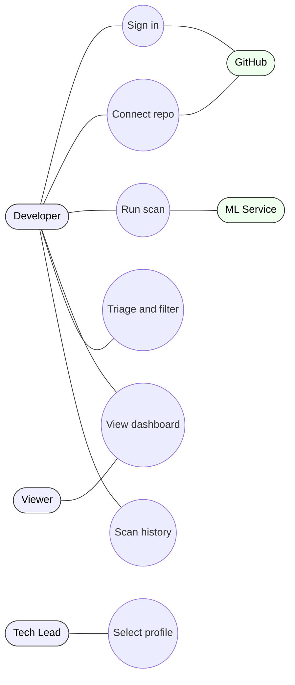
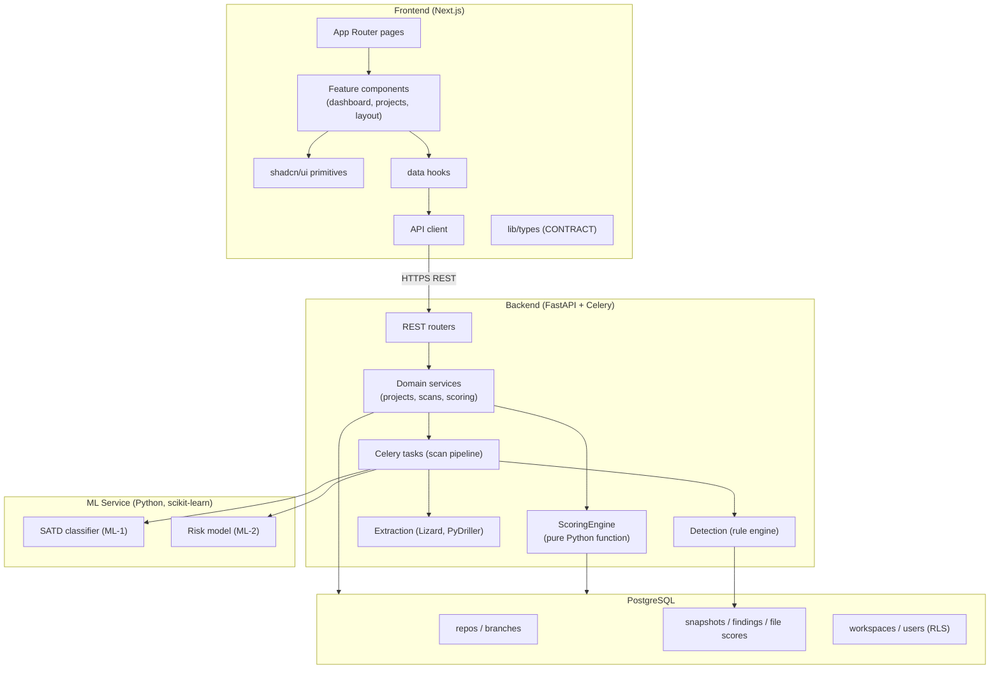
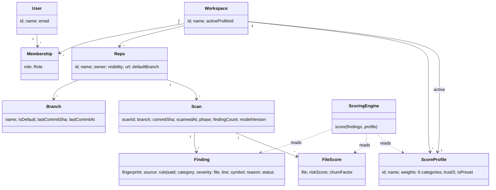
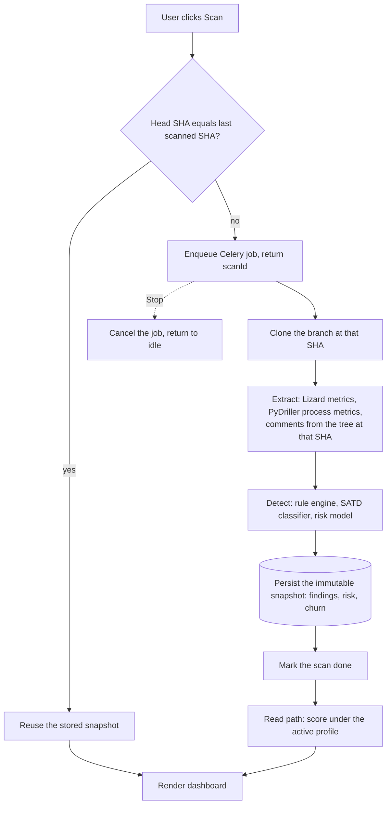
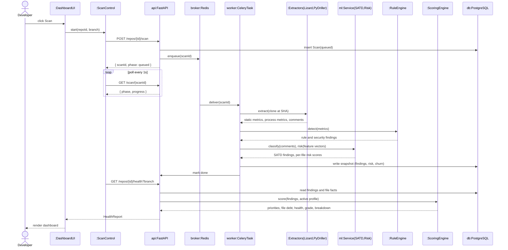
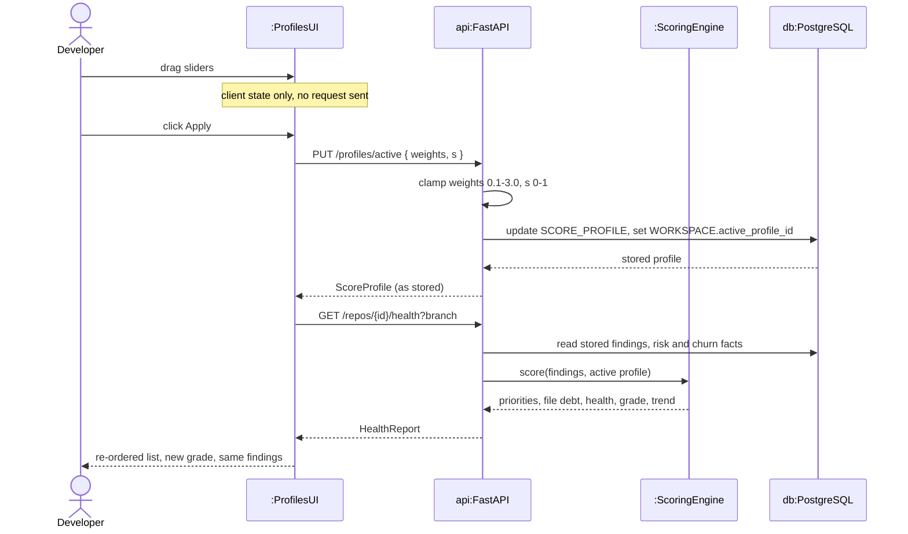
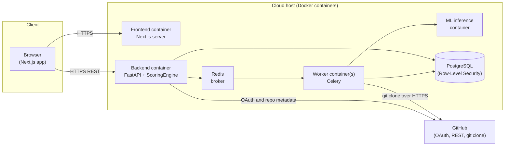
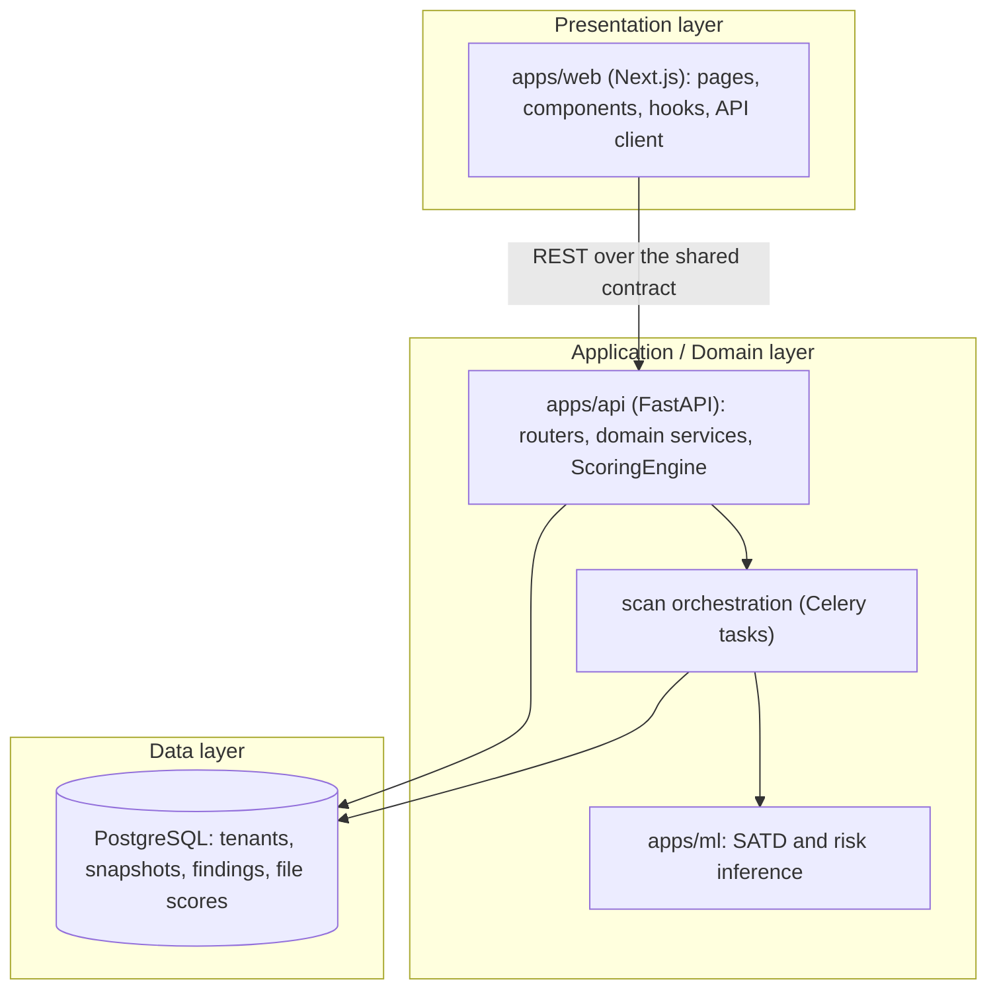

# Code Sage AI
## Software Architecture Document — Version 1.0 (v1.0 release scope)

**Group 16 · Project ID 7 · CS3203 — Software Engineering Project · Mentor: Mr. Anju Chamantha**

> **How to use this file.** It follows the course SAD template (#4, RUP "4+1" views) section for section. Diagrams are written as **Mermaid** so they render in GitHub and the architecture is captured now. For the `.docx` submission, redraw each one in draw.io or Lucidchart following the figure rules in the template: black text at 12pt or larger, white background, caption in the form "Figure n. caption", and at least one sentence of description in the text. Figure numbers here match the figure numbers in the `.docx` template exactly. Items still open for the team are marked **TEAM TODO**.

---

### Revision History

| Date | Version | Description | Author |
|---|---|---|---|
| 22/Jul/2026 | 0.1 (draft) | Initial architecture: 4+1 views, data model, quality attributes for v1.0. | Group 16 |
| 30/Jul/2026 | 0.2 (draft) | CR-001 (D-CR1 – D-CR7): domain model and data view updated for the two-value `source`, the write-once severity rule, the category weights plus trust slider profile (`w_ml` removed), risk as a scoring multiplier, and the in-place finding detail. | Group 16 |
| 31/Jul/2026 | 0.3 (draft) | CR-001 (D-CR8 – D-CR12): §9 data view — `SCAN` and `FILE_SCORE` hold facts only, every score derived on read. D-CR12 fixes the `Category` enum at six values, so `SCORE_PROFILE.weights` carries six keys. | Group 16 |
| 01/Aug/2026 | 0.4 (draft) | New §6.2 — the apply-profile write path (`PUT /api/profiles/active`), contrasted with the scan path. §9 gains `WORKSPACE.active_profile_id`. Implements SRS FR-20. | Group 16 |
| 03/Aug/2026 | 0.5 (draft) | Aligned with SRS v1.0. Three decisions recorded: repository access in v1.0 is **public URL paste only** (GitHub App moved to v1.1/v2); **scoring is a pure Python function**, never computed in the database; **no webhooks and no RBAC in v1.0**. `SCORE_PROFILE` weight count corrected to six throughout. `SUPPRESSION` removed from the v1.0 schema (SRS FR-17c makes finding actions v1.1). Figures renumbered 1–10 to match the `.docx`. | Group 16 |

---

## Table of Contents
1. Introduction (1.1 Purpose · 1.2 Scope · 1.3 Definitions · 1.4 References · 1.5 Overview)
2. Architectural Representation
3. Architectural Goals and Constraints
4. Use-Case View (4.1 Use-Case Realizations)
5. Logical View (5.1 Overview · 5.2 Architecturally Significant Design Packages)
6. Process View (6.1 The extraction boundary · 6.2 Applying a scoring profile · 6.3 The visibility floor)
7. Deployment View
8. Implementation View (8.1 Overview · 8.2 Layers)
9. Data View
10. Size and Performance
11. Quality
12. References

---

# 1. Introduction

## 1.1 Purpose

This document describes the software architecture of **Code Sage AI**, the AI-powered technical-debt analytics dashboard specified in the SRS. It uses the RUP "4+1" model, so the system is presented through five views — Use-Case, Logical, Process, Deployment and Implementation — plus a Data View, because the persistent schema carries real architectural weight in this system.

The document has three audiences. The **development team** uses it to know which component owns which responsibility before writing code. The **mentor and evaluators** use it to judge whether the design actually delivers what the SRS promises. **Future maintainers** use it to understand why the system is shaped this way, so a later change does not quietly break an assumption.

It should be read together with the SRS, which says *what* the system must do. This document says *how* the parts are arranged to do it. Where the two overlap, the SRS is the normative source and this document points back to the requirement by its ID.

## 1.2 Scope

This document covers the architecture of the **v1.0 release**: a multi-tenant web application in which a user signs in with GitHub, connects a public repository by pasting its URL, runs a scan on a chosen branch when they decide to, and reads a prioritised technical-debt dashboard built from the stored result.

It covers all four parts of the system — the frontend, the backend API and its asynchronous workers, the machine-learning service, and the database.

Three limits are worth stating clearly, because they shape several views:

- **Repository access in v1.0 is public repositories by URL only.** Sign-in uses GitHub OAuth, and the analysis pipeline reads the repository through an ordinary `git clone`. There is no GitHub App installation, no private-repository support and no webhook endpoint in v1.0. Those belong to v1.1 and v2, and the document marks the points where they would attach.
- **Scans are started by the user, never by an event.** There is no automatic or event-driven analysis in v1.0 (SRS FR-6).
- **Later-release concerns** — team management and role-based access control, private repositories, additional Git hosts — are mentioned only where they affect a v1.0 decision, such as the tenant column that exists from day one so that multi-user workspaces can be added later without a migration.

## 1.3 Definitions, Acronyms, and Abbreviations

The project keeps a single glossary in **SRS §1.3**, and that glossary is the authority. The terms used most often in this document are listed below as a convenience for the reader.

| Term | Meaning in this document |
|---|---|
| Finding | One detected issue at a `file:line:symbol`, carrying a source, a category, a severity and a one-line reason. The atomic unit of output. |
| `source` | Which detector produced a finding. Exactly two values: `rule` or `satd` (SRS FR-8.2). |
| `category` | What kind of debt a finding is. Exactly six values: `code-design`, `requirement`, `defect`, `documentation`, `test`, `security` (SRS FR-9.3). |
| Snapshot | The stored, immutable result of one scan, identified by repository, branch, commit SHA and time. |
| Scoring profile | The six category weights plus the trust slider that turn stored findings into scores (SRS FR-20). |
| Visibility floor | The rule that a critical security finding stays visible no matter how the profile is set (SRS FR-24). |
| Workspace / tenant | The top-level owner of data. A project belongs to a workspace, not to a person. |
| RLS | PostgreSQL Row-Level Security, the mechanism used to keep tenants apart. |
| ML-1 / ML-2 | The SATD comment classifier and the file-level bug-proneness risk model. |

## 1.4 References

1. **Software Requirements Specification**, Code Sage AI v1.0 — `docs/Deliverables/Software_Requirements_Specification.docx`. The normative source for every FR, NFR and appendix referenced here.
2. **Change Request CR-001** — `docs/Change Requests/CR-001_2026-07-30_scoring-model-and-finding-ux.md`. The scoring-model and finding-UX decisions (D-CR1 – D-CR12).
3. **Backend Analysis Engine design note** — `docs/Project Management & Planning/code-sage_backend-analysis-engine.md`.
4. **Release Roadmap** and **Frontend Prototype Plan** — `docs/Project Management & Planning/`.
5. **Project Proposal** and **Feasibility Report** — `docs/Deliverables/`.
6. **Shared data contract** — `apps/web/src/lib/types/index.ts`. The single source of truth for the shapes crossing the frontend, backend and database boundary (SRS SP-4).

**Diagram tool:** TEAM TODO — state the tool used for the final `.docx` diagrams and cite it in IEEE style, with the accessed date.

## 1.5 Overview

The rest of the document is organised as follows.

**Section 2** explains which architectural views are used and why. **Section 3** lists the goals and constraints that actually shaped the design, each with its architectural consequence. **Sections 4 to 8** present the five views: the use cases that exercise the architecture, the decomposition into subsystems and classes, the runtime behaviour of the processes, the physical deployment, and the layering of the codebase. **Section 9** describes the persistent data model and the rule that separates stored facts from derived scores. **Section 10** covers sizing and performance targets, and **Section 11** explains how the architecture delivers the quality attributes. **Section 12** lists the references.

---

# 2. Architectural Representation

Code Sage AI is a **multi-tenant web application with an asynchronous analysis pipeline and an offline-trained machine-learning component**. Work that takes seconds to minutes is pushed off the request path onto background workers, so the user interface stays responsive while a repository is being analysed.

All five 4+1 views are used, plus a Data View. The Data View is normally optional, but here the schema encodes an architectural rule — which values are stored and which are computed — so leaving it out would hide a central decision.

| View | What it captures | Diagrams |
|---|---|---|
| Use-Case | The user journeys that exercise the most architecture | Use-case diagram, scenario tables (Figure 1) |
| Logical | Decomposition into subsystems, layers and key classes | Package and class diagrams (Figures 2, 3) |
| Process | Runtime behaviour, background workers, how processes talk | Activity and sequence diagrams (Figures 4, 5, 6) |
| Deployment | Physical nodes and which process runs where | Deployment diagram (Figure 7) |
| Implementation | How the source code is layered and organised | Component and package diagrams (Figures 8, 9) |
| Data | The persistent multi-tenant schema | ER diagram (Figure 10) |

One idea runs through every view and is worth stating once, up front:

> **Detection and scoring happen on the server. The dashboard only reads and draws.**

This is why the client is thin, the services are stateless, and the database is the only stateful part of the system.

---

# 3. Architectural Goals and Constraints

| # | Goal or constraint | What it forces in the architecture |
|---|---|---|
| G1 | **Secure multi-tenancy** (SRS FR-2, SEC-03, DBR-3) | A workspace is a tenant. Every tenant-owned table carries `workspace_id` and is protected by PostgreSQL Row-Level Security. The column exists from day one even though v1.0 has one user per workspace, so adding teams later is not a migration. |
| G2 | **The UI must stay responsive during a scan** (SRS PERF-05, FR-6) | Scans run on Celery workers behind a Redis broker, never inside the HTTP request. The API returns a scan ID immediately and the client polls for progress. |
| G3 | **Output must be low-noise and explainable** (SRS U-4, U-6, FR-16) | A deterministic rule engine plus fixed message templates. Machine learning is surfaced as a risk level and a debt category, never as a verdict the user cannot check. |
| G4 | **Changing a profile must not require a re-scan** (SRS FR-20, FR-21, SP-7) | Scoring is a **pure Python function** over stored findings. Weights are applied at read time only. Nothing about a profile is ever written onto a finding. |
| G5 | **Severity must never be influenced by the user** (SRS FR-8.1, FR-24) | `severity` and `category` are written once, by the detector that produced the finding, and no later process updates them. The profile carries weights only. |
| G6 | **The prototype must become the product** (SRS SP-10) | The frontend is built against a frozen data contract with mock handlers. Moving to the real backend is a base-URL change, not a rewrite. |
| G7 | **Core first, on a fixed academic schedule** | The rule engine ships and works on its own. The ML models are added on top of a system that is already useful, so a weak model delays a feature rather than the release. |
| G8 | **Free, containerised, independently scalable stack** (SRS SP-20) | Each component ships as its own Docker container. Workers scale horizontally for concurrent scans. |

**Constraints.** The technology stack is fixed: Next.js and Tailwind on the frontend; FastAPI, Celery and Redis on the backend; Python with scikit-learn, Lizard and PyDriller for analysis and ML; PostgreSQL for storage; Docker for deployment. Only supervised learning is used. Models are trained offline on public datasets and loaded at runtime as versioned artifacts (SRS SP-14). The team has three members and an academic timeline, which is why v1.0 is deliberately one complete vertical slice rather than several half-finished features.

---

# 4. Use-Case View

**Actors.** Developer (primary), Tech Lead or Manager, Viewer or Stakeholder, Org Admin *(v2 only)*, GitHub *(external system)*, and the ML Service *(an internal system actor, shown because it participates in the scan)*.

**Architecturally significant use cases for v1.0.**

| ID | Use case | Actors | Why it is architecturally significant |
|---|---|---|---|
| UC-1 | Sign in | Developer, GitHub | Establishes the session and the workspace context that RLS depends on. |
| UC-2 | Connect a repository | Developer, GitHub | The only point where external repository metadata enters the system. |
| UC-3 | Run a scan | Developer, GitHub, ML Service | **The central case.** It exercises every layer, every process and every external interface. |
| UC-4 | View the health dashboard | Developer, Viewer | Exercises the read path and proves that the client computes nothing. |
| UC-5 | Triage and filter findings | Developer | Exercises the in-place detail mode and the ranked list. |
| UC-6 | Select a scoring profile | Tech Lead | The second write path, and the one that must not trigger a scan. |
| UC-7 | Browse scan history | Developer | Exercises the immutable snapshot store and the trend. |
| UC-8 | Manage team and roles *(v2)* | Org Admin | Shown only to confirm the tenant seam is placed correctly. |



*Figure 1. Use-case overview for v1.0.* Figure 1 shows the seven v1.0 use cases and the actors that take part in each. The ML Service is drawn as an actor because it is a separate process that the scan calls out to, not a library inside the worker.

**TEAM TODO:** redraw Figure 1 as a proper UML use-case diagram, with ovals inside a labelled system boundary.

## 4.1 Use-Case Realizations

### UC-3 Run a scan *(the central realization)*

| | |
|---|---|
| **Use case name** | Run a scan |
| **Actors** | Developer (starts it); GitHub and the ML Service take part |
| **Description** | Analyse the selected branch of the active project and store the result as a snapshot that the dashboard can render. |
| **Preconditions** | The user is signed in, a project is connected and selected, and a branch is chosen. |
| **Main flow** | 1. The user clicks **Scan**. 2. The API creates a scan record with phase `queued`, puts a job on the Redis queue and returns a `scanId` straight away. 3. The UI shows progress and polls the status endpoint once a second. 4. A worker clones the branch at its head commit SHA. 5. The worker extracts static metrics with Lizard, process metrics with PyDriller, and source comments from the working tree at that SHA. 6. The rule engine produces rule and security findings; ML-1 classifies the comments into SATD findings; ML-2 produces a per-file risk score. 7. The worker stores the findings, the per-file risk scores and the churn factors as an immutable snapshot. 8. The scan is marked `done`. 9. The UI requests the dashboard payload, the API scores the stored findings under the active profile, and the dashboard renders. |
| **Successful post-condition** | A new snapshot exists. The dashboard shows an updated health score, file tree, finding list and trend point, with the new last-analysed time and commit SHA. |
| **Fail post-condition** | The scan ends in `error` or `idle`. The previous snapshot is untouched and is still what the user sees. |
| **Extensions** | 3a. The user clicks **Stop**, the job is cancelled and the scan returns to `idle`. 4a. The branch head SHA equals the last scanned SHA, so the system may skip the work and reuse the stored snapshot. 6a. The ML service is unavailable, so the scan completes with rule-engine findings only — degraded, but still a valid snapshot. |

### UC-2 Connect a repository

| | |
|---|---|
| **Use case name** | Connect a repository by public URL |
| **Actors** | Developer; GitHub |
| **Description** | Add a public repository to the workspace as a project. |
| **Preconditions** | The user is signed in. |
| **Main flow** | 1. The user pastes a public repository URL. 2. The API validates the URL format and reads the repository metadata from the GitHub REST API — name, owner, visibility and default branch. 3. A project row is created under the user's workspace. 4. The project appears in the Projects list. |
| **Successful post-condition** | The project is connected and can be selected. |
| **Fail post-condition** | The URL is invalid, unreachable or not public, so an error message is shown and no project row is created. |
| **Extensions** | Private repository → this needs the GitHub App installation flow, which is **v1.1**. In v1.0 the request is rejected with a clear message. |

### UC-6 Select a scoring profile

| | |
|---|---|
| **Use case name** | Select or adjust a scoring profile |
| **Actors** | Tech Lead or Developer |
| **Description** | Change how the six debt categories are weighted, and how far the team trusts the rules against the models, then see the dashboard re-rank immediately. |
| **Preconditions** | The user is signed in and at least one snapshot exists. |
| **Main flow** | 1. The user picks a preset or moves the sliders. 2. The client holds the change locally; no request is sent while dragging. 3. The user clicks **Apply**. 4. The API clamps the weights to 0.1–3.0 and the trust value to 0–1, stores them, and sets the workspace's active profile. 5. The client re-reads the dashboard. 6. The API scores the same stored findings under the new profile and returns new priorities, scores and grade. |
| **Successful post-condition** | The list re-orders and the grade may change. **No scan runs, no worker wakes, and no snapshot is written.** |
| **Fail post-condition** | The update fails, the previously active profile stays in force, and the dashboard is unchanged. |
| **Extensions** | 4a. A weight arrives outside the allowed range and is clamped by the server before it is stored. |

**TEAM TODO:** add scenario tables for UC-4 (View the dashboard) and UC-5 (Triage and filter) before the final submission.

---

# 5. Logical View

## 5.1 Overview

The design splits into four subsystems, each internally layered.



*Figure 2. Logical decomposition into subsystems and layers.* Figure 2 shows that the shared contract in `lib/types` is what the frontend hooks are written against, and that it mirrors the API and database shapes. Note where `ScoringEngine` sits: it is called by the domain services on the **read** path, not by the workers on the write path.

## 5.2 Architecturally Significant Design Packages



*Figure 3. Core domain model.* In Figure 3, **Scan** is the aggregate root of a snapshot and **Finding** and **FileScore** are its parts. **ScoreProfile** and **ScoringEngine** sit outside that aggregate on purpose: the engine reads all three and writes none of them.

Three rules in this model are worth spelling out, because most of the architecture depends on them.

**`category` and `severity` are written once, by whoever detected the finding.** For a rule finding, both come from the rule definition in SRS Appendix C.1. For a SATD finding, ML-1 supplies the `category` and the comment-marker table in SRS Appendix C.2 supplies the `severity`. Nothing downstream recomputes either one. `ScoringEngine` reads `severity` only to look up its base points; the client reads it only to draw a badge. Because no user setting can reach these two columns, a profile change re-ranks findings without altering a single stored value. This is normative in SRS FR-8.1 and FR-9.2.

**`source` has exactly two values, `rule` and `satd`.** Only two components emit findings. Security patterns run inside the rule engine, so a security finding is a `rule` finding whose `category` is `security` — a separate `security` source value would duplicate the category axis and break the independence the model relies on. ML-2 emits no findings at all; it writes `FileScore.riskScore`. This is normative in SRS FR-8.2.

**`ScoreProfile` holds weights, never severities.** It carries six category weights, one for each value of `category`, plus a single trust scalar `s` that slides between trusting the rules and trusting the models. It is read only by `ScoringEngine`, only at scoring time. This is normative in SRS FR-20.

---

# 6. Process View

**The processes.** Four kinds of process make up a running system: the **API process** (FastAPI, stateless, can be replicated); one or more **worker processes** (Celery, where the scan pipeline runs); the **ML inference process**, which loads the two model artifacts and answers classification and risk requests; and the **database process**. The API and the workers communicate through the **Redis** broker, which carries job messages and progress state. Everything persists to **PostgreSQL**.

| Process | Kind | Talks to | Carries |
|---|---|---|---|
| API (FastAPI) | Stateless, request/response | Redis, PostgreSQL, GitHub | HTTP requests, job enqueue, all read-path scoring |
| Worker (Celery) | Long-running, background | Redis, PostgreSQL, ML service, GitHub | The clone → extract → detect → persist pipeline |
| ML inference | Long-running, request/response | Called by workers | Comment batches in, labels out; feature vectors in, risk scores out |
| PostgreSQL | Stateful | API and workers | All persistent state |



*Figure 4. Scan activity, including skip-if-unchanged and cancel.* Figure 4 shows something important about where scoring happens. The write path ends at "persist the snapshot". Scoring is not a pipeline stage — it happens later, on the read path, every time the dashboard is requested.

## 6.1 The extraction boundary

> **Git history enters the pipeline as numbers, never as text.**

Text produces findings, and a finding must land on a `file:line` the user can open — so text is read from the checked-out tree at the scanned commit. History produces metrics, so it may look backwards, but only as a numeric feature vector. This is normative in SRS FR-7.1.

| Input | Used at scan time? |
|---|---|
| Source comments at the scanned SHA | Yes — the SATD classifier reads these |
| Source files at the scanned SHA | Yes — Lizard, then the rule engine and ML-2 |
| Commit history reachable from that SHA | Yes, but only as four numbers: churn, author count, file age, recency |
| Commit message text | No — it has no `file:line`, so a finding could not point anywhere |
| Pull requests, issues, GitHub API metadata | No — the pipeline runs off a clone and uses no API quota |
| Previously stored snapshots | No — history is read only to draw trends and deltas, never to detect or score |

Two consequences follow, and the architecture leans on both.

**A scan is a pure function of the repository at one commit.** The result depends on the tree and reachable history at that SHA plus a fixed model version — never on a previous scan row. This is what makes skip-if-unchanged (branch B of Figure 4) safe, and what makes snapshots reproducible. The precision matters: a scan is independent of prior *scans*, not of git *history*, because ML-2 needs that history as numbers.

**The churn window is anchored to the commit, not to the clock.** The 90 days are measured backwards from the scanned commit's committer date, never from `now()`. Wall-clock time is not an input to scoring at all. Without this, the same commit would score differently on different days and skip-if-unchanged would be unsound. *(Decision D6, closed 27 Jul 2026; normative in SRS FR-11.)*



*Figure 5. Run-a-scan sequence.* Figure 5 shows the full path through the internal objects. Notice that `:ScoringEngine` is invoked by the **API**, after the worker has finished and the client has asked for the dashboard — never by the worker.

## 6.2 Applying a scoring profile

A profile change is the only other user-initiated write in v1.0, and it is deliberately the opposite of a scan in every way. Nothing is queued, no worker wakes and no snapshot row is written (SRS FR-20, FR-21).

| | Run a scan | Apply a profile |
|---|---|---|
| Request | `POST /api/repos/{repoId}/scan` | `PUT /api/profiles/active` |
| Handled by | API → Redis → Celery worker | The API process alone |
| Writes | A new immutable `SCAN` with its `FINDING` and `FILE_SCORE` rows | Seven numbers on one `SCORE_PROFILE` row |
| Duration | Seconds to minutes, polled | One round trip |
| Effect on findings | Creates them | Leaves them completely untouched |



*Figure 6. Apply-a-profile sequence.* Figure 6 is a write of seven numbers followed by an ordinary read. Comparing it with Figure 5 shows why a profile change costs one round trip while a scan costs minutes.

**Three properties this shape buys.**

1. **The read endpoints stay unparameterised.** The active profile is server-side state belonging to the workspace, so `GET /repos/{id}/health?branch=…` looks identical before and after a profile change. The API surface does not grow when the profile shape grows, and the scoring formula never leaks into URLs.
2. **The `PUT` is idempotent by construction.** The body is the complete profile, not a change to it, so retrying after a dropped response cannot leave a half-applied profile. That matters because the client immediately fires a dependent read.
3. **The profile is shared, not per-tab.** A reload, a second tab and a second team member all resolve the same active profile, so the profile name shown on the trend chart (SRS FR-14) always refers to something real.

**Clamping is a server-side rule, not a client convenience** (SRS FR-20). The client clamps so the sliders feel right. The server clamps because `repo_health` is calibrated against the constant `k`, and one unclamped weight from any client would make every stored grade incomparable.

## 6.3 The visibility floor

SRS FR-24 requires that a critical security finding stays visible no matter how the profile is set. This is a scoring-engine responsibility, and it is delivered by three mechanisms working together rather than by one check:

1. **Severity is not user-configurable** (§5.2), so a hardcoded secret is permanently `Critical` in the rule register.
2. **Security findings bypass the trust slider** — `source_trust` is fixed at 1.0 for the `security` category, so no trust setting can de-weight them.
3. **`ScoringEngine` pins critical security findings into the visible list** even when the security weight is at its 0.1 minimum, overriding the computed order.

Mechanisms 1 and 2 are structural, so they cannot be forgotten. Mechanism 3 is an explicit step in the engine and must have its own test (SRS TC-24).

---

# 7. Deployment View



*Figure 7. Deployment for v1.0.* In Figure 7 every box inside the cloud boundary is an independently scalable Docker container. The worker containers are the ones that scale horizontally, because concurrent scans are the only load that grows with usage. Each worker needs local disk for the clone it is analysing — around 2 GB per concurrent scan, released when the scan ends (SRS Table 3-20).

| Node | Processes hosted | Connections |
|---|---|---|
| Client device | Browser running the Next.js app | HTTPS to the frontend and the API |
| Frontend container | Next.js server | Serves the app to the browser |
| Backend container | FastAPI API process, `ScoringEngine` | Redis, PostgreSQL, GitHub (OAuth and REST) |
| Worker container(s) | Celery workers, extraction tools | Redis, PostgreSQL, ML container, GitHub (clone) |
| ML container | Model inference, loading versioned artifacts | Called by workers only |
| Redis | Broker | Private network only, never exposed publicly |
| PostgreSQL | Database, RLS enforced | Private network only, TLS |

**TEAM TODO:** confirm the hosting provider (the Feasibility Report cites DigitalOcean) and add the TLS termination and domain nodes to Figure 7.

---

# 8. Implementation View

## 8.1 Overview

The source lives in a **monorepo** with three applications — `apps/web`, `apps/api` and `apps/ml` — organised into three layers: **presentation → application/domain → data**. The shared data contract is the only agreed shape that crosses the frontend/backend boundary.

The layering rule is simple and is enforced in code review: **the presentation layer never reaches the database directly.** Every read goes through the API, and every API read that produces a score goes through `ScoringEngine`.



*Figure 8. Implementation layers and their components.* Figure 8 shows the dependency direction: it points downward only. No arrow goes from the data layer back up.

## 8.2 Layers

**Presentation — `apps/web`.** App Router pages, kept thin and fetching only through data hooks. Feature components for the dashboard, projects and layout. `shadcn/ui` primitives. One `lib/api` client module through which all HTTP passes. `lib/types`, which is the shared contract. A Mock Service Worker layer used in development and tests only, never in production.

**Application and domain — `apps/api` and `apps/ml`.** REST routers. Domain services for projects, branches, scans and profiles. `ScoringEngine`, a **pure Python function** that takes stored findings, per-file facts and the active profile and returns priorities, file debt, health, grade and the category breakdown. Celery tasks that run the clone → extract → detect → persist pipeline. Model inference for ML-1 and ML-2, plus the deterministic reason-template engine that builds the one-line explanations.

**Data — PostgreSQL.** Tenant-isolated tables with Row-Level Security, and an append-only snapshot store.

**Rules that govern the layers.**

- Volatile third-party libraries sit behind exactly one boundary each, so replacing one is a single-file change: all charts through one chart wrapper, the file tree behind one component, all HTTP through one API client (SRS SP-6).
- Rule thresholds, severity base points and profile weights are configuration or data, never literals in code, so recalibration is a config change and not a release (SRS SP-8).
- Models are trained offline and loaded at runtime as versioned artifacts, so swapping a model needs no application change (SRS SP-14).

**TEAM TODO:** draw the package diagram (Figure 9) showing the internal packages of `apps/api` — `routers`, `services`, `scoring`, `tasks`, `extractors`, `db` — and their dependencies.

*Figure 9. Package diagram of the backend application.* **(to be drawn)**

---

# 9. Data View

```mermaid
erDiagram
    WORKSPACE ||--o{ MEMBERSHIP : has
    USER ||--o{ MEMBERSHIP : in
    WORKSPACE ||--o{ REPO : owns
    REPO ||--o{ BRANCH : has
    REPO ||--o{ SCAN : has
    SCAN ||--o{ FINDING : produces
    SCAN ||--o{ FILE_SCORE : produces
    WORKSPACE ||--o{ SCORE_PROFILE : defines

    WORKSPACE { uuid id PK; text name; uuid active_profile_id FK }
    USER { uuid id PK; text name; text email }
    MEMBERSHIP { uuid id PK; uuid workspace_id FK; uuid user_id FK; text role }
    REPO { uuid id PK; uuid workspace_id FK; text name; text owner; text visibility; text url; text default_branch; timestamptz connected_at }
    BRANCH { uuid id PK; uuid repo_id FK; text name; bool is_default; text last_commit_sha; timestamptz last_commit_at }
    SCAN { uuid scan_id PK; uuid repo_id FK; text branch; text commit_sha; timestamptz scanned_at; text phase; int finding_count; text model_version }
    FINDING { uuid id PK; uuid scan_id FK; text fingerprint; text source; text category; text severity; text file; int line; text symbol; text reason; text status; text rule_id; numeric metric_value; numeric threshold }
    FILE_SCORE { uuid id PK; uuid scan_id FK; text file; numeric risk_score; numeric churn_factor }
    SCORE_PROFILE { uuid id PK; uuid workspace_id FK; text name; jsonb weights; numeric trust_s; bool is_preset }
```

*Figure 10. Multi-tenant data model.* In Figure 10, RLS policies key every tenant-owned table on `workspace_id`. `SCAN` rows are append-only, so trend, history and delta are all queries over existing rows rather than updates to them. Every table here must match the shared data contract.

**The schema stores facts, not scores.** This is the most important rule in the data view (SRS FR-21, SP-7).

`FINDING` keeps the evidence — where the issue is, what triggered it, the measured value and the threshold it crossed. `FILE_SCORE` keeps the two per-file inputs: `risk_score` from ML-2 and `churn_factor` computed from the commit-anchored window. All of these are properties of the code at that commit, so they are facts and they are stored.

**Priority, file debt, health score, grade, delta and the category breakdown are not columns.** They are functions of the active profile, so they are computed on every read by `ScoringEngine` and are never written to the database. Without this rule, an editable profile would leave every stored score stale the moment a slider moved, or would force an update that breaks the append-only property the trend chart depends on.

**Scoring is computed in Python, not in SQL.** The database returns rows; `ScoringEngine` turns them into scores. This is a deliberate decision, recorded here so it is not quietly reversed later. The reasons are:

- The scoring formula in SRS FR-11 has five factors, bounded ranges and a visibility-floor override. Expressed in SQL it becomes hard to read and harder to change.
- SRS SP-11 requires the detection and scoring path to be deterministic and exactly testable. A Python function can be unit-tested against the worked-example fixture in SRS TC-11 with no database at all.
- SRS SP-8 requires thresholds, base points and weights to live in configuration. A Python function reads that configuration naturally; a SQL view would embed the numbers in schema objects and turn recalibration into a migration.

If read latency later becomes a real, measured problem, the fix is to have PostgreSQL pre-aggregate the per-`(category, source)` sums that the formula needs — at most 6 × 2 = 12 groups — and still apply the weights in Python. That keeps the formula in one testable place. **This is an optimisation to consider only if measurement shows it is needed; it is not part of the v1.0 design.**

**Two columns deserve a note.**

`FINDING.severity` and `FINDING.category` are written once at detection and never updated, so a stored finding always renders and ranks the same way (SRS FR-8.1). `FINDING.source` is constrained to `rule` or `satd` (SRS FR-8.2). `SCORE_PROFILE.weights` is a JSON object keyed by the **six** category values (SRS FR-9.3), and `trust_s` is the scalar that replaced the old `w_ml` weight.

**The active profile belongs to the workspace, not to the session.** `WORKSPACE.active_profile_id` is a nullable foreign key to `SCORE_PROFILE`, and it is the only thing `PUT /api/profiles/active` moves besides the weights themselves. Holding it on `WORKSPACE` rather than as an `is_active` flag on `SCORE_PROFILE` makes "exactly one active profile per workspace" a structural guarantee instead of a constraint somebody has to remember to enforce. It also means the read path resolves the active profile through a join it is already making for RLS.

**Not in the v1.0 schema.** There is no `SUPPRESSION` table and no finding-action history, because v1.0 is view-only (SRS FR-17c). `FINDING.status` exists and every v1.0 finding is `open`, which is what SRS FR-11 means by "the sum of open finding priorities". Accept-debt, resolve and false-positive actions arrive in v1.1 and will add rows, not change these ones. There is also no webhook-event table and no role or permission tables beyond `MEMBERSHIP.role`, since neither event-driven scanning nor RBAC is in v1.0.

**TEAM TODO:** finalise the column types, the indexes — at minimum on `(repo_id, branch, scanned_at)` for the trend query and on `(scan_id, category)` for the breakdown — and write out the exact RLS policies.

---

# 10. Size and Performance

**What the system is sized for.** The Feasibility Report and SRS PERF-06 set the v1.0 baseline at **50 teams of up to 5 users, so 250 registered users**, while still meeting the interactive response times in SRS §3.4.1.

**How the architecture meets it.**

- **Analysis never blocks the API.** Scans run on Celery workers, so an expensive repository does not slow anybody else's dashboard (SRS PERF-05, PERF-08).
- **Reads are cheap.** A dashboard read is a database query over one stored snapshot plus an in-memory scoring pass. A profile change or a drill-in re-scores from rows already stored — no scan, no clone, no model call (SRS FR-20).
- **Workers scale horizontally.** Concurrent scan capacity is the number of worker containers, and each needs about 2 GB of local disk while it runs.
- **GitHub rate limits are avoided rather than managed.** The pipeline reads the repository through `git clone`, which uses no REST quota. The only REST calls are for repository and branch metadata, and they use ETag-based conditional requests.

| Characteristic | Target | Source |
|---|---|---|
| Registered users at baseline | 250 (50 teams × 5) | SRS PERF-06 |
| Interaction feedback | Visible within 0.1 s | SRS PERF-01 |
| Non-analysis interactions | Complete within 1 s | SRS PERF-02 |
| Scan enqueue | Within 1 s of the user clicking Scan | SRS PERF-03 |
| Progress reporting | For any operation over 10 s | SRS PERF-04 |
| Scan progress polling | Once per second | SRS Table 3-24 |
| Worker disk | ~2 GB per concurrent scan, released on completion | SRS Table 3-20 |

**TEAM TODO:** measure and record four numbers before the final submission — scan time per KLOC, maximum concurrent scans per worker, p95 dashboard read latency, and database size per snapshot. These are the numbers that will be asked about, and they cannot be guessed.

---

# 11. Quality

| Attribute | How the architecture delivers it |
|---|---|
| **Security and privacy** | Read-only repository access; only repositories the user connects; HTTPS everywhere; secrets held server-side and never sent to the client; PostgreSQL Row-Level Security for tenant isolation (SRS SEC-03, SEC-05, DBR-3). |
| **Reliability** | Snapshots are immutable, so a failed scan can never damage the last good one. A snapshot is written only after every stage succeeds (SRS REL-05). The rule engine is deterministic. If the ML service is down, the scan still completes with rule findings only — degraded, but valid. |
| **Scalability** | Stateless API and workers, independently scalable containers, queue-based load absorption. Pending work queues rather than blocking the interface (SRS PERF-09). |
| **Maintainability and extensibility** | One shared contract; a layered monorepo; volatile libraries behind single boundaries; models as swappable artifacts; scoring as a pure function. Adding a rule is one threshold entry plus one message template; adding a detector is a new `source` value (SRS SP-17). |
| **Usability** | Ranked, low-noise output; a one-line reason on every finding; a health score and grade a non-technical reader can interpret; finding detail rendered **in place** so the file tree stays visible and triage does not mean opening and closing a panel per finding (SRS FR-17). |
| **Portability** | Extraction and scoring are language-agnostic; deployment is containerised; a new language needs a rule pack and recalibration, not an engine change. |
| **Testability** | The frontend runs fully against mock handlers, the same ones used in development, unit tests and end-to-end tests (SRS SP-10). Detection is deterministic, so regression tests are exact rather than statistical (SRS SP-11). Scoring is a pure function, so it is tested against fixtures with no database. Model quality is reported as precision, recall, F1 and AUC against a rule baseline (SRS FR-25). |
| **Traceability and diagnosability** | Every log line across the API, broker, workers and ML service carries the same scan identifier, so one scan is traceable end to end (SRS SP-12). Every scan's final phase and error are stored in the database, so a user-reported failure is diagnosable without reading logs (SRS SP-13). Every snapshot records its `model_version`, so trend points stay comparable after re-training (SRS SP-15). |

---

# 12. References

References follow IEEE style. Tools are cited by their official web page with an accessed date, matching SRS §1.4 and Appendix D.

The document-level references are listed in §1.4 above. The tool and library references — Lizard, PyDriller, Tree-sitter, scikit-learn, FastAPI, Redis, Celery, PostgreSQL, Next.js and Tailwind CSS — are given in SRS §1.4 [1]–[10] and are not repeated here.

**TEAM TODO:** add the diagram tool reference once the final figures are drawn.

---

*End of SAD v0.5 draft. Redraw all ten figures per the template's figure rules, add the UC-4 and UC-5 scenario tables, and fill in the four measured performance numbers before promoting this to v1.0.*
