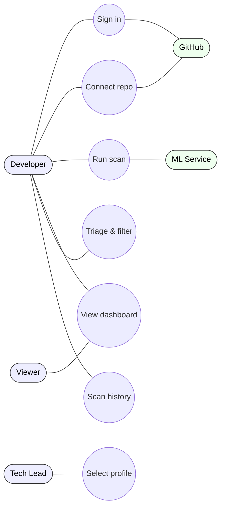
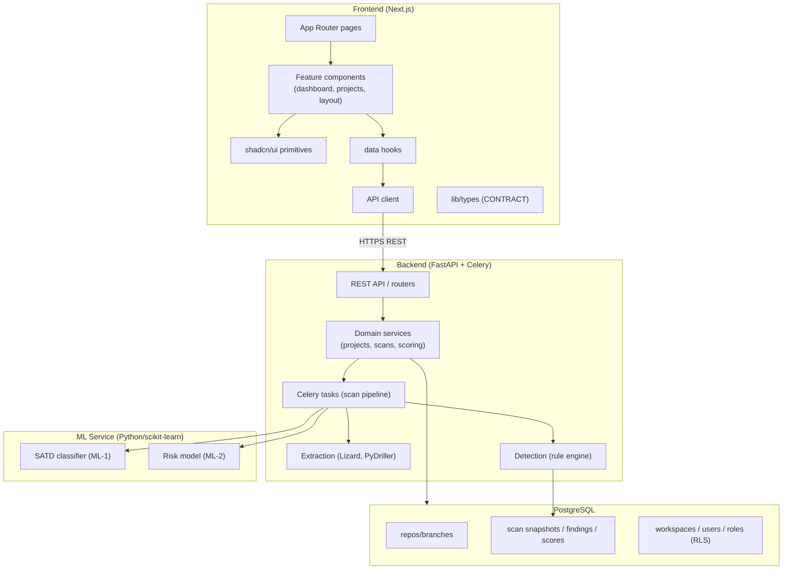
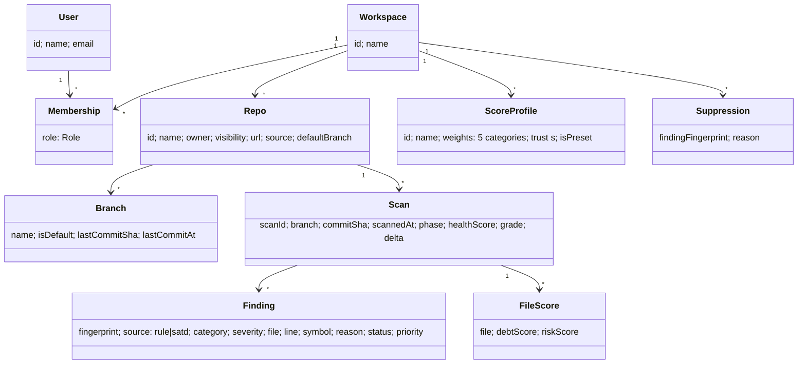
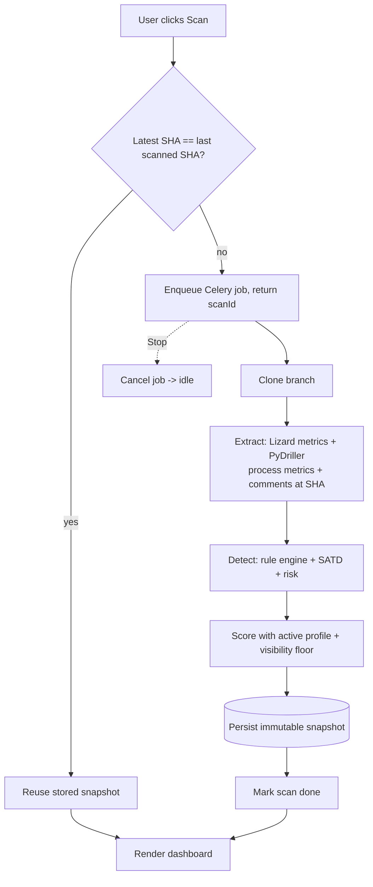
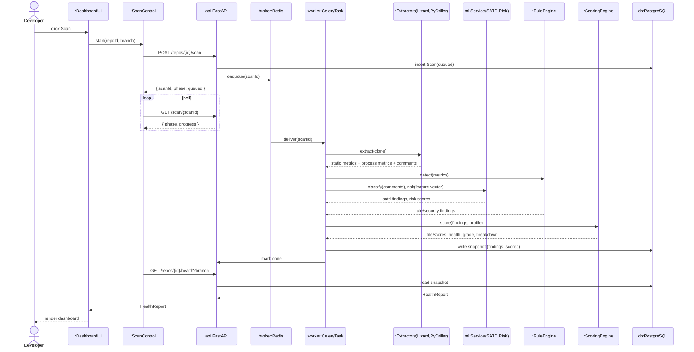
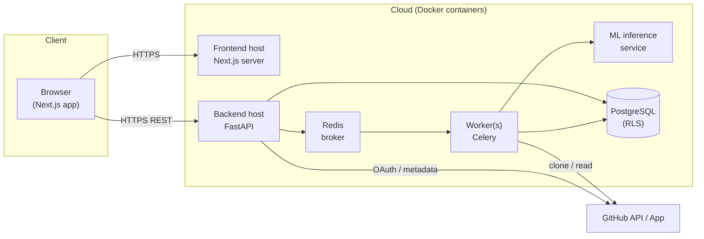
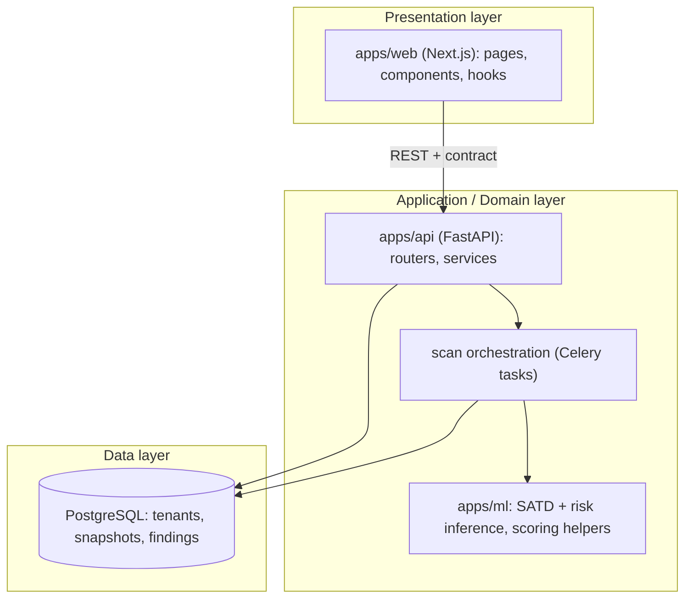

# Code Sage AI
## Software Architecture Document — Version 1.0 (v1.0 release scope)

**Group 16 · Project ID 7 · CS3203 — Software Engineering Project · Mentor: Mr. Anju Chamantha**

> ℹ️ **How to use this file.** It follows the course **SAD template (#4, RUP "4+1" views)** section-for-section. Diagrams are provided as **Mermaid** (they render in GitHub/most Markdown viewers) so the architecture is captured now; for the final `.docx` submission, **redraw each in draw.io/Lucidchart** per the template's figure guidelines (black text ≥12pt, white fill, numbered "Figure n. caption", described in ≥1 sentence). Content is grounded in the Proposal, Feasibility Report, Backend Analysis Engine doc, SRS, and Release Roadmap. Team-specific gaps are marked **✍️ TEAM TODO**.

---

### Revision History

| Date | Version | Description | Author |
|---|---|---|---|
| 22/Jul/2026 | 0.1 (draft) | Initial architecture: 4+1 views, data model, quality attributes for v1.0. | Group 16 |
| 30/Jul/2026 | 0.2 (draft) | **[CR-001](../Change%20Requests/CR-001_2026-07-30_scoring-model-and-finding-ux.md)** — domain model and data view updated for the two-value `source`, the write-once severity invariant, the five-weight + trust-slider `ScoreProfile` (`w_ml` removed), risk as a scoring multiplier, and the in-place finding-detail interaction. | Group 16 |
| ✍️ | | | |

---

## Table of Contents
1. Introduction (1.1 Purpose · 1.2 Scope · 1.3 Definitions · 1.4 References · 1.5 Overview)
2. Architectural Representation
3. Architectural Goals and Constraints
4. Use-Case View (4.1 Use-Case Realizations)
5. Logical View (5.1 Overview · 5.2 Architecturally Significant Design Packages)
6. Process View (6.1 Extraction boundary)
7. Deployment View
8. Implementation View (8.1 Overview · 8.2 Layers)
9. Data View (optional)
10. Size and Performance
11. Quality
12. References

---

# 1. Introduction

## 1.1 Purpose
This document provides a comprehensive architectural overview of **Code Sage AI**, using the **RUP 4+1 views** (Use-Case, Logical, Process, Deployment, Implementation) to capture the significant architectural decisions. Its audience is the development team (to guide implementation), the mentor/evaluators (to assess the design), and future maintainers. It should be read alongside the **SRS** (what the system must do) and the **Backend Analysis Engine** doc (how a repo becomes dashboard output).

## 1.2 Scope
The document describes the architecture of the **v1.0 release** — a multi-tenant SaaS that connects one public repository, scans a branch on demand, runs the extract→detect→score→persist pipeline, and serves a low-noise technical-debt dashboard. Later-release concerns (Team/RBAC, private repos, silent checks, multi-repo, GitLab) are noted where they affect the architecture but are not detailed. It influences the implementation of all four components (frontend, backend/workers, ML service, database).

## 1.3 Definitions, Acronyms, and Abbreviations
See **SRS §1.3** (single glossary). Key terms used heavily here: *Finding, `source` vs `category`, snapshot, scoring profile, visibility floor, workspace/tenant, RLS, Celery/Redis, Lizard, PyDriller*.

## 1.4 References
1. SRS — `docs/Deliverables/Software_Requirements_Specification.md`.
2. Backend Analysis Engine doc — `docs/Project Management & Planning/code-sage_backend-analysis-engine.md`.
3. Release Roadmap; Frontend Prototype Plan — `docs/Project Management & Planning/`.
4. Project Proposal; Feasibility Report — `docs/Deliverables/`.
5. Data contract (source of truth for shapes) — `apps/web/src/lib/types/index.ts`.

*Diagram tool:* ✍️ **TEAM TODO** — state the tool used for the final diagrams (e.g. draw.io).

## 1.5 Overview
Section 2 states which views are used and why. Section 3 lists the architecturally significant goals/constraints. Sections 4–8 present the four+one views (Use-Case, Logical, Process, Deployment, Implementation). Section 9 details the persistent data model. Sections 10–11 cover size/performance and quality attributes. Section 12 lists references.

---

# 2. Architectural Representation

Code Sage AI is a **multi-tenant, service-oriented web application** with an **asynchronous analysis pipeline** and an **offline-trained ML** component. The architecture is described with all five 4+1 views:

| View | Captures | Primary diagrams |
|---|---|---|
| **Use-Case** | Architecturally significant user journeys | Use-case diagram + scenario tables |
| **Logical** | Decomposition into subsystems/packages & key classes | Package + class diagrams |
| **Process** | Runtime behaviour, async workers, communication | Activity + sequence diagrams |
| **Deployment** | Physical nodes and their mapping to processes | Deployment diagram |
| **Implementation** | Layering of the codebase & significant components | Component/package diagrams |
| **Data (opt.)** | Persistent multi-tenant schema | ER diagram |

The **guiding invariant**: *detection and scoring happen server-side; the dashboard is a pure reader of stored snapshots.* This shapes every view (thin client, stateful DB, stateless services).

---

# 3. Architectural Goals and Constraints

| # | Goal / Constraint | Architectural impact |
|---|---|---|
| G1 | **Secure multi-tenancy** (Objective 2) | Workspace = tenant; PostgreSQL **Row-Level Security** on `workspace_id`; least-privilege repo access. |
| G2 | **Responsive UI during heavy analysis** | Scans run on **Celery workers** via **Redis** broker, off the request path; UI polls progress. |
| G3 | **Low-noise, explainable output** | Deterministic rule engine + **template reasons**; ML surfaced as risk/health, never a "bug oracle". |
| G4 | **Profile changes & drill-ins without re-scan** | Scoring is a **pure function** over stored findings; suppressions/weights applied only at scoring. |
| G5 | **Prototype = product** (no throwaway UI) | Frontend built against a **frozen data contract**; mock (MSW) → real API is a swap, not a rewrite. |
| G6 | **Core-first, on a fixed schedule** (R2/R7) | Rule engine ships standalone; ML and collaboration are incremental; v1.0 is one vertical slice. |
| G7 | **Language-agnostic architecture, validated narrowly** | Extraction/scoring language-agnostic; security rules + ML validated on **Python + JS/TS**. |
| G8 | **Free stack, containerized, independently scalable** | Docker services (frontend/backend/worker/DB); free hosting/datasets. |

**Constraints:** fixed stack (Next.js/shadcn · FastAPI/Celery/Redis · Python/scikit-learn/Lizard/PyDriller · PostgreSQL · Docker); supervised ML only (no RL); GitHub API rate limits (ETag caching + App tokens); three-member team, academic timeline.

---

# 4. Use-Case View

*Template guidance: identify ≥5 architecturally significant use cases.*

**Actors:** Developer (primary), Tech Lead/Manager, Org Admin *(v2)*, Viewer/Stakeholder, GitHub *(external system)*, ML Service *(internal system actor)*.

**Significant use cases (v1.0):**
1. **UC-1 Sign in** (Developer ↔ GitHub)
2. **UC-2 Connect a repository** (Developer)
3. **UC-3 Run a scan** (Developer → workers → ML → DB) — *architecturally central (exercises every layer)*
4. **UC-4 View the health dashboard** (Developer/Viewer)
5. **UC-5 Triage & filter findings** (Developer)
6. **UC-6 Select a scoring profile** (Tech Lead)
7. **UC-7 Browse scan history** (Developer)
8. **UC-8 Manage team & roles** *(v2 — shown for completeness)*


*Figure 1. Use-case overview (v1.0).* ✍️ **TEAM TODO:** redraw as a proper UML use-case diagram (ovals in a system boundary) in draw.io.

## 4.1 Use-Case Realizations

**UC-3 Run a scan** *(the central realization)*

| | |
|---|---|
| **Use case name** | Run a scan |
| **Actor(s)** | Developer (triggers); GitHub, ML Service (participate) |
| **Description** | Analyse the active project's selected branch and produce a stored snapshot that the dashboard renders. |
| **Preconditions** | User signed in; a project is connected and selected; a branch is chosen. |
| **Main flow** | 1. User clicks **Scan**. 2. Backend creates a scan record (`queued`) and enqueues a Celery job; returns a `scanId`. 3. UI shows progress and polls. 4. Worker `git clone`s the branch (or reuses the snapshot if the commit SHA is unchanged). 5. Worker runs **Lizard** metrics + **PyDriller** process metrics (churn, authors, age, recency) + **comment extraction from the tree at that SHA**. 6. Worker runs **rule engine**, **SATD classifier** (comments only), **risk model** → findings + per-file risk. 7. **Scoring engine** applies the active profile → file debt, health score, grade, category breakdown. 8. Results are written as an **immutable snapshot** in PostgreSQL. 9. Scan marked `done`; UI fetches the snapshot and renders. |
| **Successful post-condition** | A new snapshot exists; dashboard shows updated health, tree, list, trend; last-analyzed time + SHA updated. |
| **Fail post-condition** | On error/cancel the scan ends (`error`/`idle`); the previous snapshot is unchanged and still shown. |
| **Extensions** | 3a. User clicks **Stop** → worker cancelled, scan `idle`. 4a. SHA unchanged → skip re-analysis, reuse snapshot. 6a. ML unavailable → rule-engine-only findings (degraded but valid). |

**UC-2 Connect a repository**

| | |
|---|---|
| **Use case name** | Connect a repository (public URL) |
| **Actor(s)** | Developer; GitHub |
| **Description** | Add a public repo as a project in the workspace. |
| **Preconditions** | User signed in. |
| **Main flow** | 1. User pastes a public repo URL. 2. Backend validates and reads metadata (name, owner, default branch). 3. A project row is created under the workspace. 4. It appears in the Projects list. |
| **Successful post-condition** | Project is connected and selectable. |
| **Fail post-condition** | Invalid/unreachable URL → error message; no project created. |
| **Extensions** | Private repo → GitHub App install flow *(v1.1)*. |

> ✍️ **TEAM TODO:** add scenario tables for UC-4 (View dashboard) and UC-5 (Triage & filter), and a full UML use-case diagram.

---

# 5. Logical View

## 5.1 Overview
The design decomposes into four subsystems aligned to the components, each internally layered:


*Figure 2. Logical decomposition (subsystems & layers).* The **contract** (`lib/types`) is shared by FE hooks and mirrors the API/DB shapes.

## 5.2 Architecturally Significant Design Packages
Key domain classes (persistence + service model). ✍️ redraw as UML class diagram for the `.docx`.


*Figure 3. Core domain model.* Responsibilities: **Scan** is the immutable snapshot aggregate root; **Finding**/**FileScore** are its parts; **ScoreProfile**/**Suppression** are read only at scoring time (never mutate stored findings).

**Finding invariant — `category` and `severity` are write-once, set by the detector.** Both are assigned by the component that produced the finding (the rule definition; or ML-1 for `category` plus the comment-marker table for `severity`) and are never recomputed downstream. `ScoringEngine` reads `severity` as a lookup into base points; the client reads it to draw a badge. Neither writes it, and **no user setting can change it** — the profile carries weights only. This keeps *"the dashboard computes nothing"* true for severity as well as for scores, and it is why a profile switch re-ranks findings without altering a single stored field. Normative in **SRS FR-8.1 / FR-9.2**; rule register in SRS Appendix C.

**`source` has two values — `rule | satd`.** These are the only two components that emit findings. Security patterns execute inside the rule engine, so a security finding is a `rule` finding whose `category` is `security`; a `security` source value would duplicate the category axis exactly and destroy the orthogonality this model depends on. `RiskModel` emits **no** `Finding` — it writes `FileScore.riskScore` — so no finding can carry an `ml-risk` source. Normative in **SRS FR-8.2**.

**`ScoreProfile` holds weights, never severities.** Five `category_weight` values plus one trust scalar `s` (the rules ↔ model slider); `w_ml` has been folded into `s`. The profile is read exclusively by `ScoringEngine`, at scoring time. Normative in **SRS FR-20**.

---

# 6. Process View

*Template guidance: processes/threads and their communication; include activity + sequence diagrams (not a black box — show internal objects).*

**Processes:** the **web/API process** (FastAPI, stateless), one or more **worker processes** (Celery), the **ML inference** process/service, and the **database** process. The API and workers communicate via the **Redis** broker (job enqueue + progress); all persist to **PostgreSQL**.

**Activity — a scan:**

*Figure 4. Scan activity (with skip-if-unchanged and cancel).*

### 6.1 Extraction boundary (architecturally significant constraint)

> **Git history enters the pipeline as aggregated numbers, never as text.**

Text yields findings that must land on a `file:line`, so it is read from the checked-out tree; history yields metrics, so it may look backwards — but only as a feature vector. Normative in **SRS FR-7.1**; rationale in the backend engine doc §2.1/§3.2.1.

| Input | At scan time |
|---|---|
| Source comments at the scanned SHA | ✅ SATD classifier input |
| Source files at the scanned SHA | ✅ Lizard → rule engine, ML-2 |
| Commit history reachable from that SHA | ✅ four numeric process metrics only (churn, authors, age, recency) |
| Commit-message text | ❌ not a detection input (no `file:line`, immutable, unresolvable) |
| Pull requests / issues / GitHub API metadata | ❌ never — the pipeline runs off a clone (zero API quota) |
| Previously stored snapshots | ❌ never a model or scoring input (read-only history for delta/trend) |

**Two consequences the architecture depends on:**

1. **A scan is a pure function.** `Scan(SHA)` is determined by the repository at that SHA (tree **and** reachable ancestry), a fixed model version, and the active profile — never by a prior scan row. This is what makes skip-if-unchanged (Figure 4, branch B) architecturally sound and snapshots reproducible. Note the precision: a scan is independent of prior **scans**, not of git **history** — ML-2 requires that history, as numbers.
2. **The churn window is commit-anchored.** The 90 days are measured backwards from the **scanned commit's committer date** (the branch's last commit) — `[commit_date − 90d, commit_date]` — never from wall-clock `now()`, which is not used in scoring at all. Otherwise the same SHA would score differently over time and branch B of Figure 4 (skip-if-unchanged) would be unsound. *(Decision D6, closed 2026-07-27; normative in SRS FR-11.)*

**Sequence — Run a scan (internal objects, not a black box):**

*Figure 5. Run-scan sequence.*

---

# 7. Deployment View

*Template guidance: physical nodes and process-to-node mapping.*


*Figure 6. Deployment (v1.0).* Each box is an independently scalable Docker container; workers scale horizontally for concurrent scans. ✍️ **TEAM TODO:** confirm the hosting provider (Feasibility cites DigitalOcean) and add TLS/domain nodes.

---

# 8. Implementation View

## 8.1 Overview
The codebase is a **monorepo** (`apps/web`, `apps/api`, `apps/ml`) layered as **presentation → application/domain → data**, with a shared **contract** boundary between frontend and backend.


*Figure 7. Layered components.*

## 8.2 Layers
- **Presentation (`apps/web`):** App Router pages (thin, fetch via hooks), feature components (dashboard/projects/layout), shadcn/ui primitives, `lib/api` client, `lib/types` **contract**, MSW mock layer (dev/test only, deletable at go-live).
- **Application/Domain (`apps/api`, `apps/ml`):** REST routers; domain services (projects, branches, scans, scoring); Celery tasks (clone → extract → detect → score → persist); ML inference (SATD, risk) and the deterministic **reason-template** engine.
- **Data (PostgreSQL):** tenant-isolated (RLS) tables; append-only snapshot store.
- **Layer rules:** presentation never talks to the DB directly; the contract is the only cross-layer shape agreement; ML models are trained **offline** and loaded as artifacts (`.pkl`).

> ✍️ **TEAM TODO:** add a package diagram per layer if the marker wants finer granularity.

---

# 9. Data View

*Template guidance: persistent-data perspective (optional — but here it is significant).*

```mermaid
erDiagram
    WORKSPACE ||--o{ MEMBERSHIP : has
    USER ||--o{ MEMBERSHIP : in
    WORKSPACE ||--o{ REPO : owns
    REPO ||--o{ BRANCH : has
    REPO ||--o{ SCAN : has
    SCAN ||--o{ FINDING : produces
    SCAN ||--o{ FILE_SCORE : produces
    WORKSPACE ||--o{ SCORE_PROFILE : defines
    WORKSPACE ||--o{ SUPPRESSION : records

    WORKSPACE { uuid id PK; text name }
    USER { uuid id PK; text name; text email }
    MEMBERSHIP { uuid id PK; uuid workspace_id FK; uuid user_id FK; text role }
    REPO { uuid id PK; uuid workspace_id FK; text name; text owner; text visibility; text url; text source; text default_branch; timestamptz connected_at }
    BRANCH { uuid id PK; uuid repo_id FK; text name; bool is_default; text last_commit_sha; timestamptz last_commit_at }
    SCAN { uuid scan_id PK; uuid repo_id FK; text branch; text commit_sha; timestamptz scanned_at; text phase; int health_score; text grade; int delta; text profile }
    FINDING { uuid id PK; uuid scan_id FK; text fingerprint; text source; text category; text severity; text file; int line; text symbol; text reason; text status; numeric priority; text rule_id; numeric metric_value; numeric threshold }
    FILE_SCORE { uuid id PK; uuid scan_id FK; text file; numeric debt_score; numeric risk_score }
    SCORE_PROFILE { uuid id PK; uuid workspace_id FK; text name; jsonb weights; numeric trust_s; bool is_preset }
    SUPPRESSION { uuid id PK; uuid workspace_id FK; text finding_fingerprint; text reason }
```
*Figure 8. Multi-tenant data model.* **RLS** policies key every tenant-scoped table on `workspace_id`. **SCAN** rows are **append-only** (immutable snapshots); trend/history/delta are queries over them. These tables must satisfy the **data contract** (`lib/types`).

`FINDING.severity` and `FINDING.category` are written once, at detection, from the rule register (SRS Appendix C); for SATD rows ML-1 supplies `category` while `severity` comes from the comment-marker table (SRS FR-9.2, Appendix C.2); ML-2 produces no `FINDING` row at all — it writes `FILE_SCORE.risk_score`. No later process updates these columns, so a stored finding always renders and ranks identically (SRS FR-8.1).

`FINDING.source` is constrained to `rule | satd` (SRS FR-8.2). `SCORE_PROFILE.weights` is a JSON object keyed by the five `category` values; `trust_s` is the scalar rules ↔ model slider that replaced `w_ml`. Both are read only by the scoring pass and never written back onto a finding.

> ✍️ **TEAM TODO:** finalize column types, indexes (e.g. on `repo_id, branch, scanned_at`), and the exact RLS policies; confirm `category` values against the SATD dataset (SRS D5).

---

# 10. Size and Performance

- **Dimensioning (Feasibility):** first release scaled for **50 teams × 5 developers**; break-even at ~7 paid users.
- **Async by design:** analysis on Celery workers keeps the API responsive; workers scale horizontally for concurrent scans.
- **Cheap reads:** dashboard reads are pure DB queries over stored snapshots; profile switches/drill-ins recompute from stored findings in-memory (milliseconds), never re-scan.
- **Rate-limit resilience:** GitHub calls use ETag-cached conditional requests + App installation tokens.

> ✍️ **TEAM TODO:** set target numbers — scan time per KLOC, max concurrent scans per worker, p95 dashboard read latency, DB size per snapshot.

---

# 11. Quality

| Attribute | How the architecture delivers it |
|---|---|
| **Security & privacy** | Least-privilege read-only repo access; user-selected repos; HTTPS/TLS; secrets server-side; **RLS** tenant isolation. |
| **Reliability** | Immutable snapshots (a failed scan never corrupts the last good one); deterministic rule engine; rule-engine-only degraded mode if ML is down. |
| **Scalability** | Stateless services + independently scalable Docker containers; queue-based workers. |
| **Maintainability / Extensibility** | Single shared contract; layered monorepo; charts via one wrapper; tree library behind one boundary; models are swappable artifacts; scoring is a pure function. |
| **Usability** | Low-noise prioritized output; one-line reasons; clear health/grade for non-technical viewers; finding detail rendered **in place** (master–detail) so the file tree stays visible and triage does not require closing and reopening a panel per finding (SRS FR-17). |
| **Portability** | Language-agnostic extraction/scoring; containerized deployment; new languages via per-language rules + recalibration. |
| **Testability** | Frontend against MSW mocks (same handlers in dev/tests/E2E); deterministic detection; documented ML metrics (precision/recall/F1). |

---

# 12. References
IEEE style; tools cited by web page with "(Accessed on <date>)". Core references as in **§1.4** and the SRS §1.4. Diagram tool: ✍️ **TEAM TODO**.

*End of SAD v0.2 draft. Redraw diagrams per the figure guidelines and expand the use-case realizations before promoting to v1.0.*

*Revision note (30 Jul 2026) — **[CR-001](../Change%20Requests/CR-001_2026-07-30_scoring-model-and-finding-ux.md)**: §5.2 and §9 amended for the two-value `source` enum, the write-once `severity` invariant (now including its SATD marker source and its immunity to user settings), and the `SCORE_PROFILE` shape (five category weights + `trust_s`; `w_ml` removed). §11 notes the in-place finding-detail interaction. Architecturally the scan pipeline, the extraction boundary (§6.1) and the append-only snapshot store are **unchanged** — CR-001 alters what is stored in three columns and how the scoring pure-function combines them, not how the system is decomposed or deployed.*
