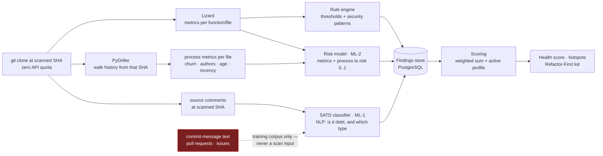
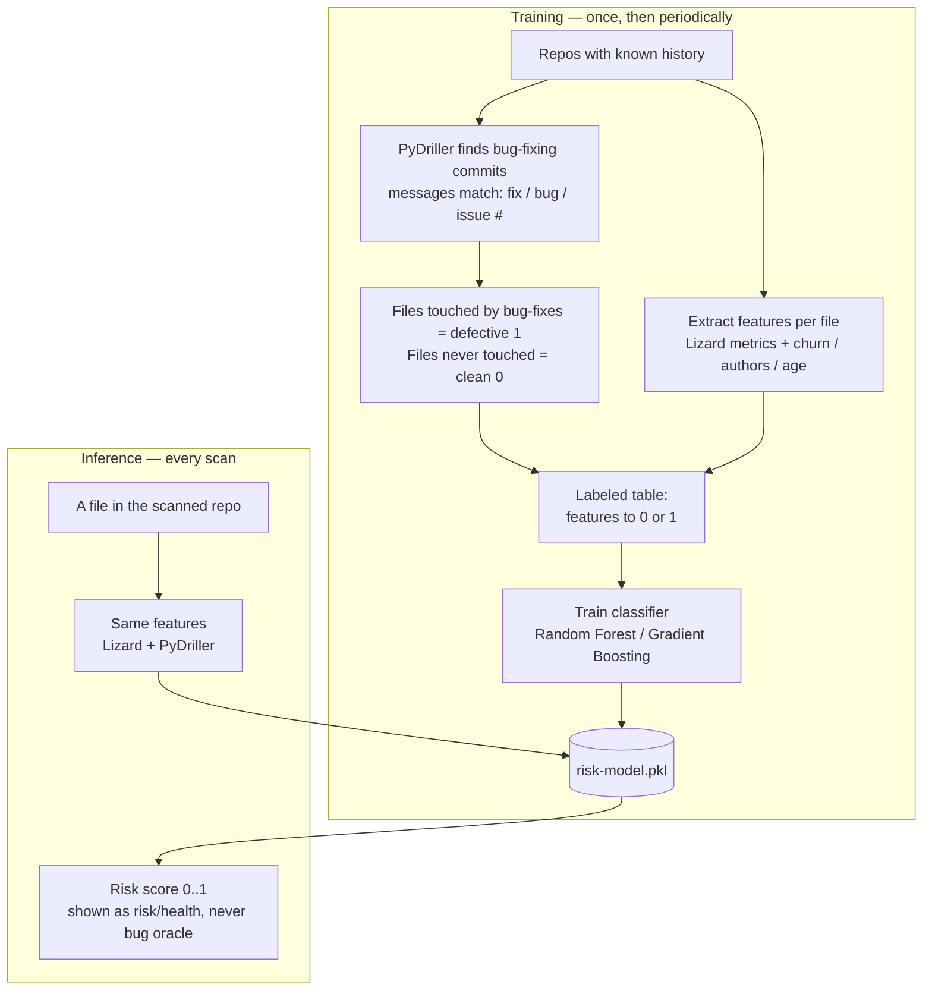
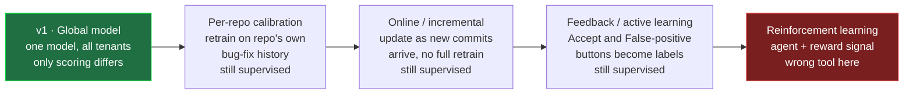
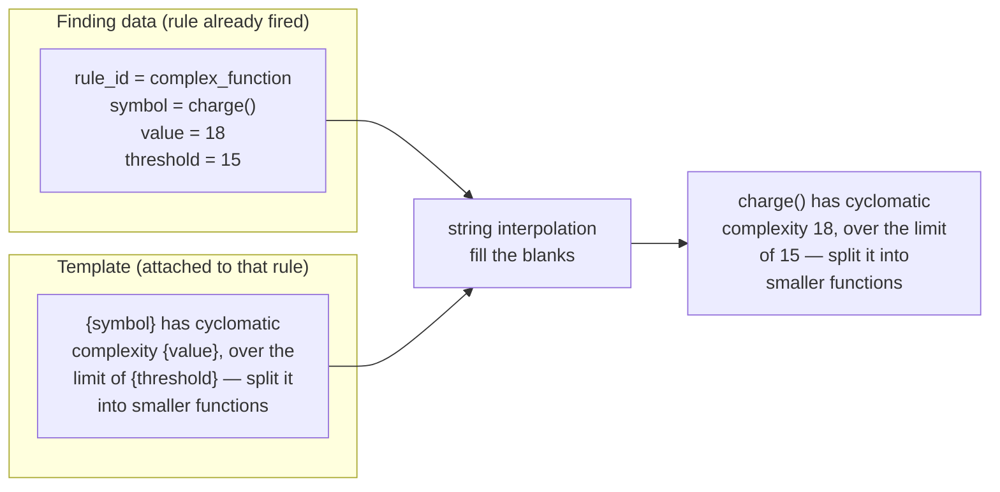

# Code Sage AI — Backend Analysis Engine: Detection, Scoring & Output Generation

**Group 16 · PID 7 · CS3203 · v1.1 · 21 Jul 2026, revised 30 Jul 2026 ([CR-001](../Change%20Requests/CR-001_2026-07-30_scoring-model-and-finding-ux.md))**
*Companion to the Development Plan. Focuses on the backend: how a cloned repo becomes dashboard output. Feeds the SRS (dashboard-output definitions, FR IDs, the reason-template table) and the SDD (pipeline + component contracts). Read the Development Plan first for the process/increment view; this document zooms into stages 2–5 of the pipeline.*

---

## Contents

1. [The one flow — signals → findings → scores → views](#1-the-one-flow)
2. [Stage 1 — Extraction (Lizard · PyDriller · text)](#2-stage-1--extraction) · [2.1 The extraction boundary](#21-the-extraction-boundary--text-is-snapshot-scoped-history-is-numeric)
3. [Stage 2 — Detection (rule engine + two ML models)](#3-stage-2--detection)
4. [The key distinction — `source` vs `category` are orthogonal](#4-source-vs-category)
5. [Model strategy — v1 is supervised, calibration is not RL](#5-model-strategy)
6. [Stage 3 — Scoring (findings → one number)](#6-stage-3--scoring)
7. [Stage 4 — Output generation (what the user sees)](#7-stage-4--output-generation)
8. [The one-line reason — deterministic templates, no NLP](#8-the-one-line-reason)
9. [Language strategy — agnostic architecture, validated narrowly](#9-language-strategy)
10. [The feasible stack in one line](#10-the-feasible-stack)

---

## 1. The one flow

Hold one mental model: **signals → findings → scores → views.** Every confusing term lives at exactly one stage. A repo comes in and the backend does four things in order — **extract raw signals → detect findings → score them → serve views.** Lizard, PyDriller, and the text extractor produce *signals*. The rule engine and the two ML models turn signals into *findings*. Scoring fuses findings into numbers. The dashboard just renders those numbers.



**The invariant that keeps the whole system honest:** the dashboard *computes nothing*. If a number on screen cannot be traced to a row in PostgreSQL, it does not go on screen. Detection and scoring happen in the backend; presentation is a pure reader of stored snapshots.

---

## 2. Stage 1 — Extraction

Three tools produce three kinds of *signal*. A signal is a measurement, not debt — CCN 18 is not debt, it is *evidence* of debt used in the next stage.

| Extractor | Produces | Used by |
|---|---|---|
| **Lizard** (static analysis) | per-function CCN, NLOC, nesting depth, parameter count, token count; per-file size, duplication | rule engine, risk model |
| **PyDriller** (history mining) | per file, as **numbers only**: churn (commits + lines changed / 90 days), author count, file age, recency | risk model (features), churn factor in scoring |
| **Text extractor** | code comments read from the **working tree at the scanned SHA** | SATD classifier |

**Why PyDriller is not a side tool.** It hands you structured `Commit` and `ModifiedFile` objects, so you compute process metrics directly from the clone. This matters because, empirically, *process metrics like churn predict defects better than static metrics like complexity* (Rahman & Devanbu). So PyDriller produces your **strongest bug-proneness features** — and, **offline during training**, it also produces your **labels** by locating bug-fixing commits from their messages. Two jobs at scan time (risk features + the churn multiplier), a third only on the training bench (label mining).

### 2.1 The extraction boundary — text is snapshot-scoped, history is numeric

One rule governs everything above, and it is worth memorising verbatim:

> **Git history enters the pipeline as aggregated numbers, never as text.**

Text produces findings that must land on a `file:line`, so it has to come from the checked-out tree. History produces metrics, so it may look backwards — but only as a feature vector.

| Input | At scan time | Why |
|---|---|---|
| Source comments at the scanned SHA | ✅ SATD input | Snapshot-scoped, `file:line`-anchored, disappears when deleted |
| Source files at the scanned SHA | ✅ Lizard → rules, ML-2 | Snapshot-scoped |
| Commit history from that SHA | ✅ **four numeric metrics only** | Aggregates cannot go stale the way a sentence can |
| **Commit-message text** | ❌ not a detection input | Immutable, unanchored, unresolvable — §3.2.1 |
| **Pull requests / issues** | ❌ not an input at all | The pipeline runs off a clone; PRs are API objects (zero-quota design) |
| Stored snapshots from earlier scans | ❌ never model or scoring input | Read-only history for delta / trend / scan-history |

**Consequence — a scan is a pure function.** `Scan(SHA)` is determined by the repository at that SHA (its tree *and* the ancestry reachable from it), a fixed model version, and the active profile. It never reads a previous scan row. Note the precise wording: a scan *is* independent of prior **scans**, but it is *not* independent of git **history** — ML-2 needs that history, as numbers.

**One consequence that follows directly — and is now decided:** the 90-day churn window is measured **backwards from the committer date of the scanned commit** (the branch's last commit), never from wall-clock `now()`:

```
window = [ commit_date(scanned_sha) − 90 days , commit_date(scanned_sha) ]
```

Had it been anchored to `now()`, re-scanning the same SHA months later would yield a different score — breaking reproducibility and undermining skip-if-unchanged (same SHA ⇒ same snapshot). Commit-anchoring also means replaying an old commit gives the churn that was true *then*, and an untouched repo does not drift in score with time alone. *(Decision D6, closed 2026-07-27 — roadmap §7.1.)*

---

## 3. Stage 2 — Detection

Signals become **findings** — the atomic unit of the product. Three detectors, but they do fundamentally different jobs.

### 3.1 Rule engine — the backbone, build first

Deterministic thresholds over Lizard's metrics plus pattern-based security rules. No training, fully explainable, never wrong in a way you cannot trace.

**Security patterns run inside this engine — there is no separate security detector.** One engine, one pass, one code path. Metric rules compare Lizard's numbers against a threshold; security rules match a regex or an entropy test against source text. That is a difference of *mechanism*, not of detector, which is why `source` has no `security` value (§4). A security finding is a rule finding whose `category` is `security`.

Every rule definition carries **four fixed things**: what it detects, the `category` it emits, the `severity` it emits, and its message template (§8). The rule knows what it found, so it knows how bad it is — nothing downstream decides this.

| `rule_id` | Trigger | `category` | `severity` |
|---|---|---|---|
| `complex-function` | `CCN > 15` | code-design | Medium |
| `long-method` | function `> 80 NLOC` | code-design | Medium |
| `deep-nesting` | `nesting > 4` | code-design | Medium |
| `duplicate-block` | duplicated block detected | code-design | Low |
| `large-file` | file `> 800 NLOC` | code-design | Low |
| `hardcoded-secret` | regex + entropy on a high-entropy string assigned to a `key`/`token`/`secret` name | security | **Critical** |
| `sql-concat` | SQL string concatenation | security | High |
| `dangerous-eval` | `eval` / `exec` usage | security | High |

**Severity is flat per rule in v1** — `complex-function` emits Medium whether the CCN is 16 or 45; a file simply accumulates more findings the worse it gets. Graduating severity by *how far past* the threshold a value sits is a v1.1 refinement that changes nothing architectural (the rule still decides, still at detection time).

**Severity is never user-configurable.** `severity` answers *"how bad is this kind of problem?"* — the same answer for every team on earth. The profile's `category_weight` (§6) answers *"how much does **this** team care about that type?"* — different per team. Merging the two would make the profile non-identifiable (many different settings producing identical rankings, with no way for a user to tell what they had changed) and would let someone set security to Low and quietly defeat the visibility floor (§7.2). Keep the **fact** system-owned and the **opinion** user-owned. *(Decision D-CR1 — see [CR-001](../Change%20Requests/CR-001_2026-07-30_scoring-model-and-finding-ux.md).)*

On its own this already produces a usable report — which is exactly why the risk register says the rule engine can ship standalone if the ML slips.

### 3.2 SATD classifier (ML-1) — the NLP part

Each **source comment from the scanned snapshot** goes in; out comes a label: *is this self-admitted debt, and if so which category* (`code-design | requirement | defect | documentation | test`). The finding is anchored to that comment's `file:line`.

- **Feasible pipeline:** TF-IDF features → Linear SVM (or Logistic Regression). SATD research repeatedly shows simple text models do this well; fine-tuned CodeBERT is a **stretch** upgrade, not a requirement.
- **Training data:** the Li, Soliman & Avgeriou "SATD from four sources" dataset already in your references — labelled comments/commits/issues/PRs from 103 Apache projects.
- **Data actually used in v1.0:** `satd-dataset-code_comments.csv` **only** — 62,275 labelled comments. The commit-message, issue and pull-request CSVs are **not used**, not even for training (see §3.2.0). Training and inference then share one distribution, so held-out comments are a real test set.
- **Hard constraint (resolved):** the SRS debt categories stand in a documented **1:1 mapping** with that file's labels — §3.2.0. *(Formerly stated as "must equal"; a deterministic rename cannot affect trainability, since the model trains on the CSV's own strings and the mapping is applied to its output.)*

#### 3.2.0 The taxonomy, read off the dataset — **D5 closed, 31 Jul 2026**

`satd-dataset-code_comments.csv`, the only file v1.0 touches:

| `Category` (product) | Dataset label | Count | Share of debt |
|---|---|---|---|
| `code-design` | `code/design_debt` | 2,703 | 66.4 % |
| `requirement` | `requirement_debt` | 757 | 18.6 % |
| **`defect`** | **`defect_debt`** | **472** | **11.6 %** |
| `test` | `test_debt` | 85 | 2.1 % |
| `documentation` | `documentation_debt` | 54 | 1.3 % |
| `security` | *(not in the dataset)* | — | rule engine only |
| *(not a category)* | `non_debt` | 58,204 | — |

**Three things this settled:**

1. **`defect` is a sixth category we did not have.** A developer admitting a *known bug* — the dataset's own example is `// FIXME formatters are not thread-safe`. It is not among the four types the paper headlines, but it is in the comment data with 472 instances, **more than `test` and `documentation` combined**. Note it is *not* ML-2: the risk model predicts **future** bug-proneness from numbers; `defect` debt is a **current, admitted** defect in prose.
2. **`non_debt` is the negative class, not a category.** It is the answer to *"is this debt at all?"* and must never reach the `Category` enum or a slider.
3. **The four sources use different taxonomies.** Comments merge code and design into one label; commits, issues and PRs split them and add `architecture_debt` and `build_debt`. Training across all four would mean reconciling three taxonomies — which is why v1.0 uses the comments file alone.

**Imbalance to state honestly:** only **6.54 %** of comments are debt, and `documentation` (0.09 %) and `test` (0.14 %) are two orders of magnitude rarer than `code-design`. Report **per-class** precision/recall/F1 with support counts; a single averaged number would hide near-total failure on the two smallest classes. The paper's **F1 = 0.611** covers a four-type task over four sources and is context, not a baseline — the baseline for Objective 5 stays the rule engine.

**Licence:** MIT (© 2022 Yikun Li) — permissive, commercial use permitted, attribution required.

#### 3.2.1 Where a SATD finding's `severity` comes from — the marker table

The classifier predicts a **category**. It does **not** predict severity, and it cannot: a supervised model can only predict what its training data labels, and the Li dataset labels categories, not severities. There is no answer key for severity, so it must come from somewhere deterministic.

Assigning every SATD finding a flat `Medium` was the first answer and it is wrong — `# FIXME: auth check is bypassed` and `# TODO: rename this variable` are not equally bad. So after the model decides *"this is debt, category X"*, a regex over the comment text decides *how bad*:

| `severity` | Pattern (case-insensitive, word-boundary) | base_points |
|---|---|---|
| **High** | `\b(FIXME\|BUG\|XXX\|BROKEN\|DO\s*NOT\s*(SHIP\|MERGE))\b` | 5 |
| **Medium** | `\b(TODO\|HACK\|TEMP\|TEMPORARY\|WORKAROUND\|KLUDGE\|REFACTOR)\b` | 3 |
| **Low** | `\b(NOTE\|REVIEW\|NIT\|IDEA\|QUESTION\|MAYBE)\b` | 1 |
| **Medium** *(default)* | no marker matched | 3 |

Rules for applying it:

- Evaluate **High → Medium → Low**; the highest match wins, so `# FIXME: TODO later` is High.
- Match **anywhere** in the comment, not only at the start — `// this is a temporary workaround` must hit.
- **No marker ≠ not debt.** The model catching *"this whole module is a mess, sorry"* with no keyword at all is exactly why ML-1 exists instead of a plain regex scan. Those default to Medium.

The split encodes a real distinction: `FIXME`/`BUG`/`BROKEN` mean *something is wrong*; `TODO`/`HACK` mean *it works but it is ugly*; `NOTE`/`NIT` mean *for your information*. Every row is defensible line by line, and the mechanism is the same hand-written table already used for rules. *(Decision D-CR2.)*

**The clean division of labour:** the **probabilistic** part decides *is this debt, and of what type*; the **deterministic** part decides *how bad*. Each half does what it is actually good at.

#### 3.2.2 Why inference is comments-only — the distinction that is easy to miss

**Training corpus ≠ inference input.** The dataset is titled *"SATD from four different sources"*, and that phrase has quietly been read as if it described what the *running system* consumes. It does not — it describes the **labelled text you train on**. Train on all four sources if the extra data helps, but **evaluate on held-out comments**, because comments are the only distribution the deployed model will ever see.

Commit-message SATD is excluded from v1 detection for three reasons, each disqualifying on its own:

1. **No `file:line` anchor.** Every Refactor-First row needs `file:line`, and the detail panel resolves `file:line:symbol` (and later the snippet). A commit message has a SHA and *n* touched files — nothing to point at, nothing to display. The finding cannot be rendered in the UI we have already built.
2. **It permanently corrupts health and the trend chart.** History only grows, and commit messages are immutable, so historical SATD findings would **accumulate forever with no removal event**. A team that fixed everything would still watch its score decay — which destroys `delta` and the trend chart, the two features the append-only snapshot store exists to serve.
3. **No resolution signal.** A comment admitting debt is evidence the debt *is still there* — the comment is still in the file. A commit message is evidence debt existed *at one past instant*, with no way to tell whether it was later paid off. That is an unfalsifiable finding.

The contrast is the whole argument: **comment SATD is self-healing.** Delete the `# TODO`, the next scan doesn't see it, the finding vanishes, health rises. That is exactly the behaviour the trend chart is supposed to make visible.

*(Commit-message SATD as a **file-level, time-windowed signal** — treated like churn rather than as a list row — is a reasonable later feature. It is a different design, not a deferral of this one.)*

**And the naming trap to defend in the viva:** **GHPR** stands for *GitHub Pull Request* dataset — but it is an offline CSV used to train ML-2. Someone will read "GHPR" and conclude the system ingests PRs at scan time. It does not; the pipeline never leaves the clone.

### 3.3 Risk model (ML-2) — bug-proneness, explained slowly

The question it answers: *"which files are likely to contain future bugs?"* You cannot ask a model that until you first *show* it what buggy files look like — which means **labels**. That labelling step is the piece most people miss:



**Two sources of labelled data, used for different purposes:**

- **Public datasets** — for training a general model and for the Objective-5 evaluation (documented precision/recall/F1 vs the rule baseline). Ranked by trust:
  - **GHPR** — 6,052 file instances from real GitHub bug-fixing PRs, already balanced defective/clean. Modern and realistic → **use as primary.**
  - **BugHunter** — file/class/method-level bug snapshots with before/after states → good if you want method-level granularity.
  - **NASA PROMISE** (KC1/JM1/…) — classic teaching benchmark, but old with documented data-quality problems (Shepperd et al. found duplicates and errors). Cite honestly as a **legacy baseline**, lean on GHPR.
- **The repo's own history** — for per-repository calibration (a *future* feature; see §5). PyDriller detects that repo's bug-fixing commits, marks touched files defective, and you retrain locally.

**Features** (same in training and inference): Lizard's product metrics (CCN, NLOC, nesting, params, comment ratio) + PyDriller's process metrics (churn, author count, age, recency). **Model:** Random Forest / Gradient Boosting → probability 0–1, which *is* the risk score. Because buggy files are rare, **never report accuracy** — use precision/recall/F1/AUC, and handle imbalance with class weights or SMOTE. Present the output as a **risk/health indicator**, never "bug prediction."

---

## 4. `source` vs `category`

The single most important distinction in the output layer. Every finding carries **both** fields, and they answer different questions on orthogonal axes:

- **`source`** = *which detector found this?* → `rule | satd`
- **`category`** = *what type of debt is it?* → `code-design | requirement | defect | documentation | test | security` (§3.2.0)

A finding is never "either a rule finding or a debt-type finding" — it is *both at once*: found by X, classified as type Y. This resolves "do we categorize from SATD or rules or the risk model?":

| Source | How the `category` is assigned | Deterministic or ML? |
|---|---|---|
| **Rule engine** | Hard-coded in the rule. "Long method" always emits `code-design`; "hardcoded secret" always emits `security`. The rule knows what it detects. | **Deterministic** |
| **SATD classifier (ML-1)** | *Predicted from the comment text* — literally the model's job; the Li dataset labels are the categories. | **ML** |
| **Risk model (ML-2)** | **Does not assign a category at all.** It outputs a per-file risk *score*, a different axis. | **N/A — it scores, it does not label** |

**The correction to hold onto:** debt type comes from **rules (deterministic mapping) + SATD (ML prediction)**. The risk model does *not* categorize debt — it colours hotspots and boosts ranking. Keep the jobs separate.

**Consequence — what populates the Refactor-First list:** concrete findings from **rules + SATD**, because each points at a specific `file:line:symbol` you can actually go fix. The risk score is *file-level* — it does not say "fix line 42" — so it is **not** a line-item. Use it to lift risky files up the ranking (§6) and show it as a badge ("risk 0.78"); the actionable rows are rule/SATD findings.

#### 4.0.1 Why `source` has exactly two values

The enum originally read `rule | satd | security | ml-risk`. Two of those values were unsound:

- **`security` duplicated the category.** Security patterns run inside the rule engine (§3.1), so a security finding was always `source: security` **and** `category: security` — the same word on both axes, perfectly correlated. Two axes that always agree are one axis, which contradicts the whole point of this section.
- **`ml-risk` was a value nothing could hold.** The risk model produces no findings, so no `FINDING` row could ever carry it. It appeared in zero fixtures because it was unreachable by construction.

Collapsing to `rule | satd` loses nothing:

| Question | Answered by |
|---|---|
| "Is this a security issue?" | `category === "security"` |
| "How bug-prone is this file?" | `FileScore.risk_score` and the file badge — not a finding at all |
| "Which rule mechanism fired?" | `rule_id` — the rule register in §3.1 |

It also makes the trust slider (§6) coherent: it has **two ends because there are exactly two sources**, so one control spans the entire axis. *(Decision D-CR3.)*

### 4.1 The third axis — where `severity` comes from

`source` and `category` answer *who found it* and *what type it is*. **`severity` answers *how bad it is*, and it is the input `finding_priority` actually multiplies (§6).** It is assigned **at detection**, written onto the finding, and never recomputed:

| Producer | Who assigns `severity` | How |
|---|---|---|
| **Rule engine — metric rules** | The rule definition | Fixed per rule — see the §3.1 register. `long-method` is always Medium. |
| **Rule engine — security patterns** | The rule definition | Fixed per rule, and always high: `hardcoded-secret` = **Critical**, `sql-concat` / `dangerous-eval` = High. This is what makes §7.2's "floats up by severity" work. |
| **SATD classifier (ML-1)** | **Not the model** | ML-1 predicts `category` only — it has no severity output and cannot have one (nothing in the training data labels severity). Severity comes from the **comment-marker regex table** in §3.2.1: `FIXME` → High, `TODO` → Medium, `NOTE` → Low, no marker → Medium. |
| **Risk model (ML-2)** | Nobody | It has **no `severity` and no `category`** — it is not a list row. It is a file-level score that multiplies every finding in that file through `risk_factor` (§6) and is shown as a badge. |
| **The user** | **Never** | The profile changes `category_weight` and `source_trust` (§6), never `severity`. See §3.1. |

**The rule that makes this defensible: no ML model and no user ever assigns a severity.** Severity is 100% deterministic in v1 — the same argument as §8. You never want *"the model thinks this is probably critical"*, or *"the team set security to Low last sprint"*, deciding what a security lead sees first.

**One value, read twice.** The stored `severity` string is consumed by exactly two consumers, so they can never disagree:

```
detection assigns severity  →  stored on the FINDING row
                                   ├─→ scoring:  severity → base_points (§6)
                                   └─→ UI:       severity → badge + colour token
```

The dashboard performs no judgement — it renders the stored string. This is the *dashboard computes nothing* invariant applied to severity.

---

## 5. Model strategy

### 5.1 v1 is pure supervised learning

Both models are classic supervised learning: **label → train → infer.**

- **SATD classifier** learns from labelled text (comment tagged debt/not-debt + category), then at inference returns a label for a new comment.
- **Risk model** learns from labelled files (defective 1 / clean 0), then at inference returns a risk score for a new file.

In both cases you **train once, then only run inference** on every scan. No learning happens during normal operation — the trained `.pkl` just answers questions.

### 5.2 Per-repo calibration is *not* reinforcement learning

This misconception would cost real complexity, so the distinction matters:

> **Supervised learning is studying with an answer key** — flashcards with the question on the front and the correct answer on the back. You see input, you already know the right answer, you learn the mapping.
>
> **Reinforcement learning is learning to ride a bike** — nobody hands you the "correct" move; you try things, the world rewards (stayed upright) or penalizes (fell over), and you adjust a *strategy* to maximise reward. No labels, no answer key.

Per-repo calibration is **still studying with an answer key — just a different deck of cards.** PyDriller harvests labels from *this repo's own history* (bug-fixed files = "defective", the rest = "clean") and you retrain the **same supervised model** on that local deck. Same method, different data source. No agent, no actions, no reward → **not RL, and not conceptually complex.** Its real cost is *operational* (per-tenant model storage, a retraining pipeline, per-repo evaluation) — which is the legitimate reason to defer it, not the algorithm.

### 5.3 v1 architecture: one global model, scoring personalizes

**One shared SATD model + one shared risk model, trained on public datasets, byte-for-byte identical for every tenant.** What differs per user is *only* the scoring layer — the weight profile and the accepted-debt suppressions. This is not a compromise; it is exactly consistent with the Development Plan's rule that **detection is profile-independent and only scoring reads the profile.** Deferring calibration changes nothing structurally — the risk model is simply global instead of per-repo, and it is *simpler to defend in the viva* than a per-repo scheme.

### 5.4 The adaptation spectrum — and where RL sits



Reading left to right: **calibration** retrains on repo-local labels; **online learning** updates as new commits land (label still "did this file get bug-fixed later"); **feedback/active learning** turns your existing *Accept* / *False-positive* buttons into new training labels. All three are still supervised. **RL is the odd one out and the wrong fit** — it pays off for sequential decisions with delayed rewards (games, robotics), not "predict which files are risky," where you have direct labels. So for this problem you essentially never want RL.

**Takeaway:** what "learns from user input" evokes *is* real and valuable — but it is **supervised/online/feedback learning**, and the cleanest future version is "turn the Accept and False-positive signal into training data," bolted on later with zero change to v1.

**Effect on the language caveat (below):** with calibration deferred, the honest v1 claim is simply *"trained on public defect datasets, validated on Python and JavaScript; accuracy on other languages is not claimed"* — clean and defensible.

---

## 6. Stage 3 — Scoring

Everything above produces a pile of findings plus one risk score per file. Scoring fuses them with a **pure function** — both the weight profile and the suppressions apply *only here*, so changing a profile or accepting a TODO **never requires a rescan**.

### The recipe (v1 — illustrative, calibrate on golden repos)

Severity base points: **Critical 8 · High 5 · Medium 3 · Low 1**

**`base_points` is a lookup, not a judgement.** It is a four-entry map over the `severity` the detector already assigned and stored (**§4.1**) — scoring never decides how bad a finding is, it only decides how much that badness is *worth under the active profile*. This is why the badge a user sees and the ranking they see can never disagree: both read the same stored string.

```
churn_factor(file) = 1 + min(commits_90d, 20) / 20          # range 1.0 – 2.0
                     # 90d measured BACK FROM THE SCANNED COMMIT'S DATE
                     # (the branch's last commit) — never from now().
                     # Decided: D6. See §2.1.

risk_factor(file)  = 1 + ml_trust × risk_score              # range 1.0 – 2.5

finding_priority   = base_points(severity)        # system: the rule register (§3.1, §3.2.1)
                   × category_weight[category]    # user:   6 sliders
                   × source_trust(finding)        # user:   trust slider
                   × churn_factor(file)           # evidence: how hot the file is
                   × risk_factor(file)            # model:  how bug-prone the file is

file_debt          = Σ finding_priority (open findings only)
repo_health        = 100 × (1 − min(1, Σ file_debt / (k × KLOC)))   # k calibrated
grade              = A ≥ 85 · B ≥ 70 · C ≥ 55 · D ≥ 40 · E < 40
```

**Every term has exactly one owner and one job, and nothing is counted twice.** Read the five factors as five separate questions: *how bad is it · what type is it · who found it · how hot is the file · how fragile is the file.*

#### 6.1 The profile — six category weights and one trust slider

The **weight profile** is the *only* place security-first vs delivery-speed acts. It has two kinds of control, each on exactly one axis:

```
category_weight[category]        # 6 sliders, clamped 0.1 – 3.0
s ∈ [0, 1], default 0.5          # 1 slider: "rules ←→ model"

rule_trust = 0.5 + s             # 0.5 … 1.5
ml_trust   = 1.5 − s             # 1.5 … 0.5

source_trust(finding) =
    1.0          if finding.category == "security"    ← never de-weighted (§7.2)
    rule_trust   if finding.source   == "rule"
    ml_trust     if finding.source   == "satd"
```

| Profile (preset) | security | code-design | defect | requirement | documentation | test | `s` |
|---|---|---|---|---|---|---|---|
| **Balanced** (default) | 1.0 | 1.0 | 1.0 | 1.0 | 1.0 | 1.0 | 0.5 |
| **Security-first** | **3.0** | 1.0 | 1.2 | 0.8 | 0.5 | 1.0 | 0.5 |
| **Delivery-speed** | 1.5 | 1.2 | **1.5** | 0.8 | 0.5 | 0.5 | **0.7** |

Three things worth stating explicitly:

- **The weights are indexed by `category`, matching the formula.** The earlier vector mixed axes — it carried `satd` (a *source*) and `duplication` (a *rule*) while omitting `requirement`, `documentation` and `test` entirely, so a documentation-category SATD finding had no defined weight. *(Decision D-CR4.)*
- **The trust slider is one degree of freedom, which is exactly right.** For ranking, only the *ratio* between the two sources matters. `s = 0.5` gives both 1.0, so the default position changes nothing; neither end ever reaches 0, so no slider position can silently suppress a finding.
- **`w_ml` is gone**, folded into `ml_trust`. It was asking the same question the slider asks — *how much do you trust the machine learning?* — and both ML-1 (SATD findings) and ML-2 (the risk factor) now fade and strengthen together. *(Splitting them into two dials is a reasonable [v1.1] option; one dial suits the low-configuration positioning.)*
- **Security sits off the slider**, keyed on `category`. All security detection is deterministic, so without this exclusion the "trust the model" end would quietly halve every security finding — an inversion nobody would intend.

#### 6.2 Why risk multiplies instead of adding

The risk score used to appear only as `+ w_ml × (risk_score × 10)` in `file_debt`. That had a bug and a smell:

- **The bug:** §3.3 and SRS FR-10 both say the risk score *"boosts ranking"* — and it never did. Ranking was identical for a Medium finding in a 0.95-risk file and the same finding in a 0.05-risk file.
- **The smell:** a file could be tinted red purely by risk and then open to an **empty** detail panel. *"This file is red because the model feels uneasy"* is exactly the un-actionable noise this product exists to avoid.

Risk is a per-file signal you want to boost findings by — which is structurally identical to **churn**, so it gets the same treatment: a bounded multiplier. The additive term is removed, so every point of debt now traces to a finding a user can click.

**Accepted consequence:** a risky file with **zero findings** scores zero debt and shows green. ML-2 can amplify files that already have findings but can no longer surface a file on its own. The `risk 0.78` badge stays on the file row and in the tree, so risk remains visible as **its own signal** without inventing debt — two honest signals beat one blended number. *(Decision D-CR5.)*

**The bound is a feature.** Maximum combined boost is `churn 2.0 × risk 2.5 = 5×`, which is **less than the 8× spread between Low (1) and Critical (8)**. So within a category, the ML can nudge the ordering but can **never** push a Low finding above a Critical one — the deterministic severity ranking cannot be inverted by a model.

> ⚠️ **`k` must be recalibrated.** `file_debt` has changed scale — a term removed, a multiplier of up to 2.5× added. The previous `k` is not valid.

### 6.3 Worked example — one file, three lenses

`payments/payment_service.py` — NLOC 420, max CCN 18, churn 14 commits/90d → `churn_factor = 1.7`. ML-2 risk = 0.78. Findings detected (always, regardless of profile):

| # | `source` | Finding | `category` | `severity` | base |
|---|---|---|---|---|---|
| F1 | rule | `complex-function` — `charge()` CCN 18 > 15 | code-design | Medium | 3 |
| F2 | rule | `long-method` — `charge()` is 95 NLOC | code-design | Medium | 3 |
| F3 | satd | `# TODO: temporary hack until v2 ships` → marker `TODO` | code-design | Medium | 3 |
| F4 | rule | `hardcoded-secret` — Stripe API key | security | **Critical** | 8 |

**Balanced** — all weights 1.0, `s = 0.5` → `rule_trust = ml_trust = 1.0`, `risk_factor = 1 + 1.0 × 0.78 = 1.78`:

| | calculation | priority |
|---|---|---|
| F1 | `3 × 1.0 × 1.0 × 1.7 × 1.78` | 9.08 |
| F2 | `3 × 1.0 × 1.0 × 1.7 × 1.78` | 9.08 |
| F3 | `3 × 1.0 × 1.0 × 1.7 × 1.78` | 9.08 |
| F4 | `8 × 1.0 × **1.0** × 1.7 × 1.78` | **24.21** |

`file_debt = 51.45`

**Security-first** — `security = 3.0`, `s = 0.5`: F4 becomes `8 × 3.0 × 1.0 × 1.7 × 1.78 =` **72.62**; F1–F3 unchanged. `file_debt = 99.86`, and F4 is unambiguously the **#1** Refactor-First item.

**Trust-the-rules** — `s = 1.0` → `rule_trust = 1.5`, `ml_trust = 0.5`, `risk_factor = 1.39`:

| | calculation | priority |
|---|---|---|
| F1 | `3 × 1.0 × 1.5 × 1.7 × 1.39` | 10.63 |
| F3 *(SATD)* | `3 × 1.0 × 0.5 × 1.7 × 1.39` | **3.54** |
| F4 | `8 × 1.0 × 1.0 × 1.7 × 1.39` | 18.90 |

The self-admitted TODO drops below the measured rule findings — exactly what a team saying *"we trust the rules more than the model"* is asking for. Note F4 is unmoved by the slider in both directions: security is off the axis.

*Same findings, three different lenses, no rescan.* Detection is profile-independent; only scoring reads the profile — so switching profiles recomputes in milliseconds from stored findings, and "accepting" a TODO is just a filter at this same layer.

---

## 7. Stage 4 — Output generation

### 7.1 The six outputs

1. **Health Score card** — grade + delta vs previous scan. **Follows drill-in:** a folder's health is just the aggregation of the stored file scores beneath it, so clicking a folder re-aggregates its subtree — no rescan, because you are summing numbers already in PostgreSQL. Repo health is the same aggregation at the root.
2. **Hotspot file tree** — red→green by per-file debt score, click to drill.
3. **Refactor-First list** — top-N rule/SATD findings; each row: `category` chip, `severity` chip, `file:line`, and the one-line reason (§8). SATD rows carry a third **`SATD` source chip**; rule rows carry none, because `rule` is the default and a chip that is always present carries no information.
4. **Finding detail — rendered *in place*, not as an overlay.** Selecting a finding switches the dashboard into **detail mode**: the region that holds the health card and trend chart is replaced by the finding's evidence, reason and `file:line:symbol` (with room for the [v1.1] snippet), the file tree on the right **auto-expands and highlights that finding's file**, and the Refactor-First list shrinks to a strip so the user can move between findings without closing anything. Closing restores the health card and chart. *(Decision D-CR7 — this is the master-detail pattern; a slide-over covers the tree, costs a close-and-reopen per finding, and is too narrow to render a code snippet without wrapping.)* Actions (Accept / Resolve / False-positive) remain **[v1.1]** — v1.0 is view-only.
5. **Category breakdown + filter by debt type** — a `WHERE category = …` over the findings store, no new computation. Persona-driven: security lead filters to `security`, tech lead to `code-design`, a docs pass to `documentation`. **Confirmed — build it.**
6. **Trend chart** — health-per-scan over time; repo-scoped by default, or scoped to a selected file/folder by filtering that node's findings across scans. Same stored snapshots, different slice. **Every point is computed under the *currently active* profile**, and the chart carries the profile's name — see §7.3.

### 7.3 What a profile change actually changes

Changing a weight or the trust slider is **not a scan**. No worker runs, no clone happens, and **no snapshot row is written** — a snapshot is keyed by commit SHA, and a profile is not a commit. If a profile change wrote a snapshot, the trend chart would show a step on a day nobody touched the code: the line would read *"the codebase got worse"* when it means *"we changed our mind about what matters."*

That works because of one rule:

> **Store the facts. Derive the opinions.**

| Stored (facts about the commit) | Derived on read (opinions under a profile) |
|---|---|
| Findings — `file`, `line`, `symbol`, `source`, `category`, `severity`, evidence, reason | `finding_priority` |
| Per-file `risk_score` (ML-2) and `churn_factor` | `file_debt`, the tree tint |
| `commit_sha`, `scanned_at`, `finding_count`, `model_version` | `repo_health`, `grade`, `delta`, the category pie |

This is the same fact/opinion line as `severity` versus `category_weight` (§3.1), applied one level up. It is also what makes FR-20's promise — *re-score instantly, never re-scan* — actually true: a stored score would be stale the moment a weight moved.

**The trend uses one lens at a time.** Switching profile redraws the whole line under the new profile, so every point stays comparable. Mixing profiles along one line is prohibited — the reader could not tell a code change from a settings change.

**Cost:** a weighted sum over rows already in PostgreSQL — a few thousand multiply-adds for a 20-scan history. If that ever matters, store two sums per `(category, source)` group per scan (`Σ base×churn` and `Σ base×churn×risk`); since the profile factors are constant within a group and `risk_factor` splits linearly, an exact re-score of the full history becomes a few hundred operations over at most 10 groups. *(See [CR-001 D-CR8 – D-CR11](../Change%20Requests/CR-001_2026-07-30_scoring-model-and-finding-ux.md).)*

#### 7.3.1 The endpoint — one small write, then an ordinary read

Dragging a slider sends **nothing**. The six weights and `s` live in the browser until the user presses **Apply**, which issues exactly one request:

```
PUT /api/profiles/active
{ "weights": { "security": 3.0, "code-design": 1.0, "defect": 1.2,
               "requirement": 0.8, "documentation": 0.5, "test": 1.0 },
  "s": 0.5 }
→ 200 ScoreProfile   (the values as stored, after clamping)
```

What the handler does, in full:

1. **Clamp** every weight to `0.1–3.0` and `s` to `0–1`. Do this server-side even though the sliders already cannot exceed it — the sliders are a UI affordance, the clamp is the invariant, and `repo_health` is calibrated against `k` (§6). Reject nothing; clamp silently and return what was stored, so the client can render the corrected value rather than believe its own.
2. **Write** the workspace's `SCORING_PROFILE` row and mark it active (SAD §9). Six numbers — five weights and the trust slider. The same row is updated in place; profiles are not versioned and no history is kept. "At most one active profile per workspace" is held by a partial unique index on the table, so the database refuses a second active row rather than this handler having to remember (locked decision 11). Clear the old row and set the new one in one transaction. No queue, no worker, no clone, no `SCAN` row.
3. **Return the stored profile.** The client then re-issues its normal reads — `GET /api/repos/{id}/health?branch=…` — and the scoring pass above runs under the new profile.

**Why `PUT` and not `PATCH`.** The body is the *complete* profile, not a delta, so applying it twice is applying it once — which matters because the client fires a dependent read immediately after, and a retry on a dropped response must not leave three weights updated and three not.

**Why the profile is not a query parameter on the reads.** It would work — `?profile=security-first` — and it is tempting because it needs no write at all. Two things kill it for v1.0: a *custom* slider setting has no name, so it would have to travel as seven query parameters on every read, putting the scoring formula's shape into every URL in the product; and nothing would persist, so a reload, a second tab, or a teammate would each see a different lens while the trend chart claims to be labelled with "the" active profile (§7.3, one lens at a time). Storing it once, server-side, keeps the read surface stable and the lens shared.

**Do the summation in SQL.** This is the one implementation choice that decides whether derive-on-read is fast: `SUM(...) GROUP BY file` in PostgreSQL is single-digit milliseconds, while loading ~40k finding rows into Python objects and looping is the same arithmetic 100× slower. The multiply-adds are free either way — the I/O and object overhead are not.

**No cache invalidation problem, by construction** — because nothing derived is stored as truth (D-5). The one exception is the denormalised Projects-list hint, which carries `cached_under_profile`; the apply handler does **not** need to recompute it, because the read path already recomputes any row whose stamp differs from the active profile.

### 7.2 Surfacing a critical security issue (the API key)

Four mechanisms stack, **none involving ML**:

- **Detection is deterministic** — caught by a rule (regex + entropy), because you never want "the model *thinks* there might be a secret" for something this important.
- **Its severity is a constant nobody can drag** — `hardcoded-secret` = Critical is written in the §3.1 register, not derived from a profile or a model (§4.1).
- **It floats up by severity** — `critical` = 8 base points; a security-first profile multiplies further (the worked example put it at #1), and the trust slider cannot pull it down because the `security` category is excluded from `source_trust` (§6.1).
- **It has a hard visibility floor** — *critical security findings are never suppressed or down-weighted below visibility, regardless of the active profile.* A delivery-speed profile may de-prioritize a long method; it must never hide a leaked credential. Normative in **SRS FR-24**.

> ⚠️ **The floor is now code, not prose.** While profiles were presets-only, this rule held by construction — no preset set security low enough to matter. Now that a user can drag the security weight to 0.1 (§6.1), it must be **implemented**: critical security findings are *pinned* into the visible list regardless of computed priority. A sentence in the SRS is no longer sufficient on its own.

---

## 8. The one-line reason

The part that sounds hardest is the easiest. **You do not need another NLP model.** Every real static-analysis tool — SonarQube, ESLint, Pylint, Bandit — generates these messages with **string templates**, not AI. The reason is not *generated*; it is a **template attached to each rule, with the finding's own data interpolated into the blanks.**



Pure string formatting. When a rule fires it already knows the symbol, the measured value, and its own threshold, so filling the template is one line of code. The result is **reliable** (never hallucinates), **explainable** (you know exactly why each line appears), **instant**, and **free** (zero inference cost). For a debt tool, deterministic is *better* than AI-generated here — you never want a fix hint that confidently lies.

**How each source produces its reason (all template-based):**

- **Rule** — one template per rule: `"{symbol} is {value} lines long (limit {threshold}) — consider extracting a helper."`
- **SATD** — quotes the *actual comment you already extracted* + the predicted category: `"Self-admitted debt: '{comment_text}' — classified as {predicted_category}."` → *"Self-admitted debt: 'TODO: temporary hack until v2 ships' — classified as code-design."* No generation — you paste a string you already have next to a label the model returned. There is **one** SATD template; the marker table (§3.2.1) sets the severity, not the wording.
- **Risk** (file badge, not a list row) — surfaces the salient raw signals: `"High-risk file (0.78): high complexity (CCN 18) and frequent change (14 commits/90d)."` Notable feature values, not a precise causal breakdown.

**So the reason engine *is* ~30–50 hand-written templates** (one per rule + one SATD pattern + one risk pattern). The differentiator is not AI prose — it is that you *bothered to attach a plain-English explanation to every rule* while SonarQube dumps raw rule IDs. A **curation effort, not a modeling problem.**

**That table is also the severity register.** One row per rule, four columns — `rule_id → severity → category → message` — and three of them are exactly the things a rule hard-codes (§3.1, §4.1). Once it is drafted in full, *"where does severity come from?"* has a one-sentence answer: **column 2 of the rule table.** It is the single artefact that closes the rule definition, and the natural next thing to write (SRS Appendix C).

### Do not confuse two different features

| Feature | Mechanism | Status |
|---|---|---|
| **One-line reason** ("hardcoded secret — move to an env variable") | Deterministic template | **Core — build in v1** |
| **AI *fix suggestion*** (rewriting `charge()` into corrected code) | Needs an LLM | **Stretch — human-approved diff, later phase** |

The reason explains *what is wrong and the general remedy* from a template. A fix suggestion writes *the actual replacement code* and needs generation. v1 commits only to the first.

---

## 9. Language strategy

The honest answer is **both, at different layers** — a strength to state in the defence, not a weakness. Build a **language-agnostic architecture, validated on 1–2 languages.**

**Language-agnostic (nearly free):**
- **Lizard** extracts the same metrics across its ~15+ supported languages.
- **PyDriller** is 100% language-independent — it reads VCS metadata, not code.
- **Metric-based rules** (CCN, NLOC, nesting) apply to any language.
- **The SATD model is the most portable ML part** — comments are English regardless of the programming language, so a Java-trained SATD classifier reads Python comments fine. (Only the comment *syntax* is language-specific, and that is a tokenizer concern, not a model one.)

**Language-specific (why you validate narrowly):**
- **Security rules** (SQL concatenation, `eval`/`exec`, secret patterns) need per-language patterns; writing good ones for 30 languages is infeasible for three people.
- **Bug-proneness transfer across languages is empirically weak** — a Java-trained model will not calibrate cleanly to Go. Per-repo calibration (a future feature) neutralizes most of this, but you still cannot *claim* validated accuracy on languages you never tested.

**Recommendation:** **Python + JavaScript/TypeScript** — your own stack (Next.js + FastAPI), which lets you **dogfood by scanning your own repo** (the Inc 2 "scan Code Sage AI itself" moment), and both are extremely common in small teams. Swap JS for **Java** if you want tighter alignment with GHPR/PROMISE training data.

**The framing to write down:** *"Extraction and scoring are language-agnostic by design; detection quality and the ML evaluation are validated on Python and JavaScript, with new languages added by supplying per-language security rules and recalibrating."*

---

## 10. The feasible stack

Rule engine first (deterministic, ships standalone) → SATD via **TF-IDF + Linear SVM** trained on the Li dataset but **applied only to comments in the scanned snapshot** (CodeBERT as stretch) → bug-proneness via **Random Forest / Gradient Boosting** on Lizard metrics + the four PyDriller process metrics, evaluated on **GHPR** (F1, not accuracy), calibrated per-repo only as a *future* feature → fuse with the weighted-sum score → present risk as risk/health, never a bug oracle → surface every finding with a **deterministic template reason**, security behind a **visibility floor**.

**One modeling component (the two ML models), zero additional NLP.** Categorization is rules + the SATD model; security surfacing is deterministic rules + a floor; the celebrated one-line reason is hand-written templates. The "AI" lives in *detection*; the *outputs* are deterministic — which is precisely what makes them trustworthy, and what you can defend line by line in the viva.

---

*End of v1.0 — companion to the Development Plan. Freeze the §2.1 extraction boundary, the §4 `source`/`category` schema and the §8 template approach before SRS write-up; the reason-template table (rule → severity → category → message) is the natural next artifact to draft in full.*

*Revision note (27 Jul 2026): §1, §2, §3.2, §6, §9 and §10 amended to make the extraction boundary explicit — SATD inference is comments-only, commit history is consumed as four numeric process metrics, PRs/issues are never scan inputs, and the churn window is measured back from the scanned commit's date (decision **D6**, closed 27 Jul 2026 — wall-clock `now()` is not used in scoring). Mirrored in SRS FR-7.1 / FR-9.1 / FR-11 and SAD §4.1 (UC-1), §6.1. **D5 (SATD category enum) remains open.***

*Revision note (30 Jul 2026) — **[CR-001](../Change%20Requests/CR-001_2026-07-30_scoring-model-and-finding-ux.md)**: §3.1, §3.2.1, §4, §6, §7.1, §7.2 and §8 amended for seven accepted decisions. Severity is system-owned and defined in the §3.1 rule register (**D-CR1**); SATD severity comes from the §3.2.1 comment-marker table instead of a flat `Medium` (**D-CR2**); `source` collapses to `rule | satd` (**D-CR3**); the profile becomes per-category weights plus one rules↔model trust slider, and `w_ml` is removed (**D-CR4**; the weight count was fixed at **six** on 31 Jul by **D-CR12**); the risk score becomes a bounded multiplier on `finding_priority` and its additive `file_debt` term is removed (**D-CR5**); custom sliders move into v1.0 with the presets retained as seeds (**D-CR6**); the finding detail renders in place rather than as a slide-over (**D-CR7**). Mirrored in SRS FR-8/8.1/9/9.2/10/11/15/17/18/20/24 and Appendix C, SAD §5.2/§6.1/§9/§11. **`k` must be recalibrated** — `file_debt` has changed scale. **D5 is now CLOSED** — see the 31 Jul note below.*

*Revision note (31 Jul 2026) — **[CR-001](../Change%20Requests/CR-001_2026-07-30_scoring-model-and-finding-ux.md) D-CR8 – D-CR12**: new §3.2.0 records the debt taxonomy read off `satd-dataset-code_comments.csv`, closing **D5**. A sixth category, **`defect`**, is added on the evidence of 472 labelled instances; `non_debt` is the negative class and never a category; label strings are normalised through a documented 1:1 mapping; and v1.0 trains **and** infers on the comments file alone, because the four sources do not share a taxonomy. §6.1 gains the sixth weight. New §7.3 states that a profile change is not a scan, that the store holds facts while scores are derived, and that the trend chart uses a single lens. Dataset licence confirmed **MIT**. Mirrored in SRS FR-9/9.1/9.3/11/12/14/20/21/25, DB-8, L-3.*
