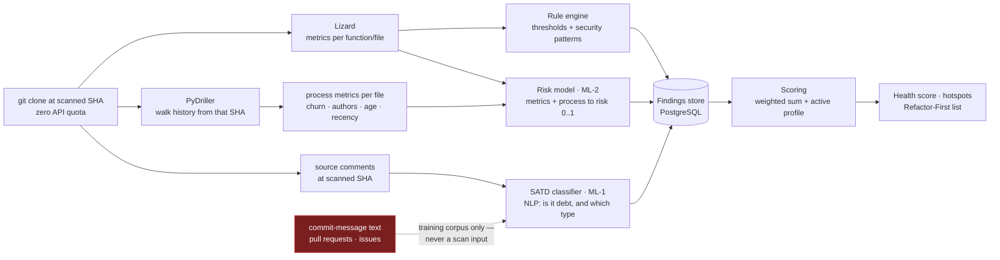
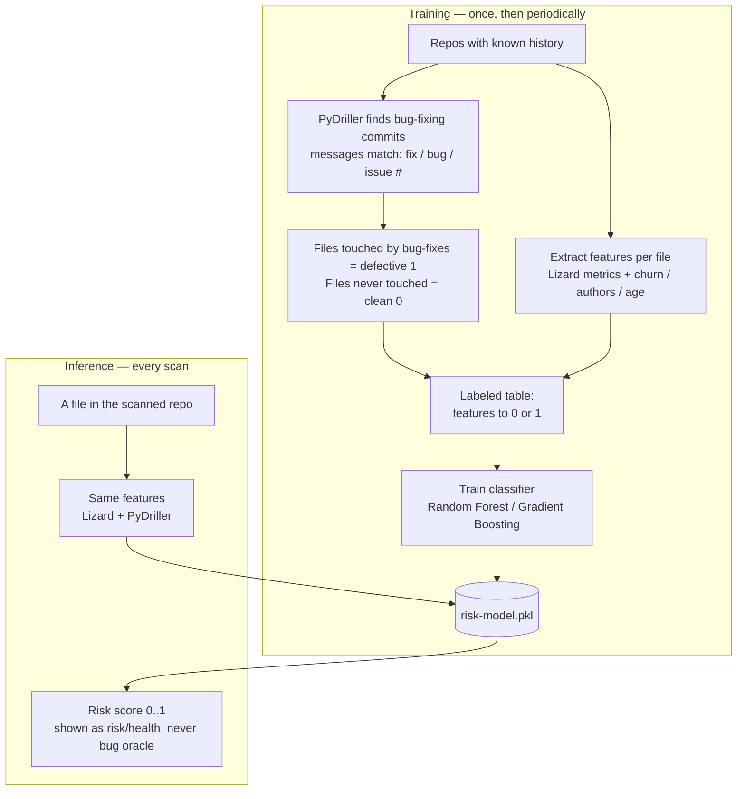
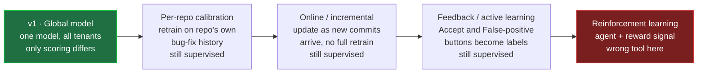
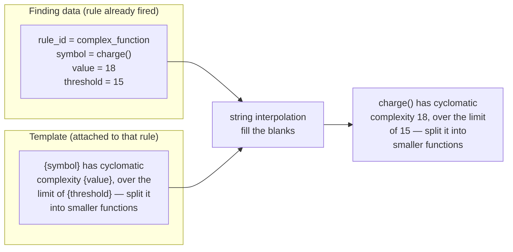

# Code Sage AI — Backend Analysis Engine: Detection, Scoring & Output Generation

**Group 16 · PID 7 · CS3203 · v1.0 · 21 Jul 2026**
*Companion to the Development Plan. Focuses on the backend: how a cloned repo becomes dashboard output. Feeds the SRS (dashboard-output definitions, FR IDs, the reason-template table) and the SDD (pipeline + component contracts). Read the Development Plan first for the process/increment view; this document zooms into stages 2–5 of the pipeline.*

---

## Contents

1. [The one flow — signals → findings → scores → views](#1-the-one-flow)
2. [Stage 1 — Extraction (Lizard · PyDriller · text)](#2-stage-1--extraction) · [2.1 The extraction boundary](#21-the-extraction-boundary--text-is-snapshot-scoped-history-is-numeric)
3. [Stage 2 — Detection (rule engine + two ML models)](#3-stage-2--detection)
4. [The key distinction — `source` vs `category` are orthogonal](#4-source-vs-category)
5. [Model strategy — v1 is supervised, calibration is not RL](#5-model-strategy)
6. [Stage 3 — Scoring (findings → one number)](#6-stage-3--scoring)
7. [Stage 4 — Output generation (what the user sees)](#7-stage-4--output-generation)
8. [The one-line reason — deterministic templates, no NLP](#8-the-one-line-reason)
9. [Language strategy — agnostic architecture, validated narrowly](#9-language-strategy)
10. [The feasible stack in one line](#10-the-feasible-stack)

---

## 1. The one flow

Hold one mental model: **signals → findings → scores → views.** Every confusing term lives at exactly one stage. A repo comes in and the backend does four things in order — **extract raw signals → detect findings → score them → serve views.** Lizard, PyDriller, and the text extractor produce *signals*. The rule engine and the two ML models turn signals into *findings*. Scoring fuses findings into numbers. The dashboard just renders those numbers.



**The invariant that keeps the whole system honest:** the dashboard *computes nothing*. If a number on screen cannot be traced to a row in PostgreSQL, it does not go on screen. Detection and scoring happen in the backend; presentation is a pure reader of stored snapshots.

---

## 2. Stage 1 — Extraction

Three tools produce three kinds of *signal*. A signal is a measurement, not debt — CCN 18 is not debt, it is *evidence* of debt used in the next stage.

| Extractor | Produces | Used by |
|---|---|---|
| **Lizard** (static analysis) | per-function CCN, NLOC, nesting depth, parameter count, token count; per-file size, duplication | rule engine, risk model |
| **PyDriller** (history mining) | per file, as **numbers only**: churn (commits + lines changed / 90 days), author count, file age, recency | risk model (features), churn factor in scoring |
| **Text extractor** | code comments read from the **working tree at the scanned SHA** | SATD classifier |

**Why PyDriller is not a side tool.** It hands you structured `Commit` and `ModifiedFile` objects, so you compute process metrics directly from the clone. This matters because, empirically, *process metrics like churn predict defects better than static metrics like complexity* (Rahman & Devanbu). So PyDriller produces your **strongest bug-proneness features** — and, **offline during training**, it also produces your **labels** by locating bug-fixing commits from their messages. Two jobs at scan time (risk features + the churn multiplier), a third only on the training bench (label mining).

### 2.1 The extraction boundary — text is snapshot-scoped, history is numeric

One rule governs everything above, and it is worth memorising verbatim:

> **Git history enters the pipeline as aggregated numbers, never as text.**

Text produces findings that must land on a `file:line`, so it has to come from the checked-out tree. History produces metrics, so it may look backwards — but only as a feature vector.

| Input | At scan time | Why |
|---|---|---|
| Source comments at the scanned SHA | ✅ SATD input | Snapshot-scoped, `file:line`-anchored, disappears when deleted |
| Source files at the scanned SHA | ✅ Lizard → rules, ML-2 | Snapshot-scoped |
| Commit history from that SHA | ✅ **four numeric metrics only** | Aggregates cannot go stale the way a sentence can |
| **Commit-message text** | ❌ not a detection input | Immutable, unanchored, unresolvable — §3.2.1 |
| **Pull requests / issues** | ❌ not an input at all | The pipeline runs off a clone; PRs are API objects (zero-quota design) |
| Stored snapshots from earlier scans | ❌ never model or scoring input | Read-only history for delta / trend / scan-history |

**Consequence — a scan is a pure function.** `Scan(SHA)` is determined by the repository at that SHA (its tree *and* the ancestry reachable from it), a fixed model version, and the active profile. It never reads a previous scan row. Note the precise wording: a scan *is* independent of prior **scans**, but it is *not* independent of git **history** — ML-2 needs that history, as numbers.

**One consequence that follows directly — and is now decided:** the 90-day churn window is measured **backwards from the committer date of the scanned commit** (the branch's last commit), never from wall-clock `now()`:

```
window = [ commit_date(scanned_sha) − 90 days , commit_date(scanned_sha) ]
```

Had it been anchored to `now()`, re-scanning the same SHA months later would yield a different score — breaking reproducibility and undermining skip-if-unchanged (same SHA ⇒ same snapshot). Commit-anchoring also means replaying an old commit gives the churn that was true *then*, and an untouched repo does not drift in score with time alone. *(Decision D6, closed 2026-07-27 — roadmap §7.1.)*

---

## 3. Stage 2 — Detection

Signals become **findings** — the atomic unit of the product. Three detectors, but they do fundamentally different jobs.

### 3.1 Rule engine — the backbone, build first

Deterministic thresholds over Lizard's metrics plus pattern-based security rules. No training, fully explainable, never wrong in a way you cannot trace.

- `CCN > 15` → *complex function*
- function `> 80 NLOC` → *long method*
- `nesting > 4` → *deep nesting*
- duplicated block; file `> 800 NLOC`
- **Security patterns:** hardcoded secret (regex + entropy on a high-entropy string assigned to a `key`/`token`/`secret` name), SQL string concatenation, `eval`/`exec` usage

On its own this already produces a usable report — which is exactly why the risk register says the rule engine can ship standalone if the ML slips.

### 3.2 SATD classifier (ML-1) — the NLP part

Each **source comment from the scanned snapshot** goes in; out comes a label: *is this self-admitted debt, and if so which category* (`code/design | requirement | documentation | test`). The finding is anchored to that comment's `file:line`.

- **Feasible pipeline:** TF-IDF features → Linear SVM (or Logistic Regression). SATD research repeatedly shows simple text models do this well; fine-tuned CodeBERT is a **stretch** upgrade, not a requirement.
- **Training data:** the Li, Soliman & Avgeriou "SATD from four sources" dataset already in your references — labelled comments/commits/issues/PRs from 103 Apache projects.
- **Hard constraint:** your SRS debt categories **must equal that dataset's labels**, or the model is untrainable and Objective 5 becomes untestable.

#### 3.2.1 Why inference is comments-only — the distinction that is easy to miss

**Training corpus ≠ inference input.** The dataset is titled *"SATD from four different sources"*, and that phrase has quietly been read as if it described what the *running system* consumes. It does not — it describes the **labelled text you train on**. Train on all four sources if the extra data helps, but **evaluate on held-out comments**, because comments are the only distribution the deployed model will ever see.

Commit-message SATD is excluded from v1 detection for three reasons, each disqualifying on its own:

1. **No `file:line` anchor.** Every Refactor-First row needs `file:line`, and the detail panel resolves `file:line:symbol` (and later the snippet). A commit message has a SHA and *n* touched files — nothing to point at, nothing to display. The finding cannot be rendered in the UI we have already built.
2. **It permanently corrupts health and the trend chart.** History only grows, and commit messages are immutable, so historical SATD findings would **accumulate forever with no removal event**. A team that fixed everything would still watch its score decay — which destroys `delta` and the trend chart, the two features the append-only snapshot store exists to serve.
3. **No resolution signal.** A comment admitting debt is evidence the debt *is still there* — the comment is still in the file. A commit message is evidence debt existed *at one past instant*, with no way to tell whether it was later paid off. That is an unfalsifiable finding.

The contrast is the whole argument: **comment SATD is self-healing.** Delete the `# TODO`, the next scan doesn't see it, the finding vanishes, health rises. That is exactly the behaviour the trend chart is supposed to make visible.

*(Commit-message SATD as a **file-level, time-windowed signal** — treated like churn rather than as a list row — is a reasonable later feature. It is a different design, not a deferral of this one.)*

**And the naming trap to defend in the viva:** **GHPR** stands for *GitHub Pull Request* dataset — but it is an offline CSV used to train ML-2. Someone will read "GHPR" and conclude the system ingests PRs at scan time. It does not; the pipeline never leaves the clone.

### 3.3 Risk model (ML-2) — bug-proneness, explained slowly

The question it answers: *"which files are likely to contain future bugs?"* You cannot ask a model that until you first *show* it what buggy files look like — which means **labels**. That labelling step is the piece most people miss:



**Two sources of labelled data, used for different purposes:**

- **Public datasets** — for training a general model and for the Objective-5 evaluation (documented precision/recall/F1 vs the rule baseline). Ranked by trust:
  - **GHPR** — 6,052 file instances from real GitHub bug-fixing PRs, already balanced defective/clean. Modern and realistic → **use as primary.**
  - **BugHunter** — file/class/method-level bug snapshots with before/after states → good if you want method-level granularity.
  - **NASA PROMISE** (KC1/JM1/…) — classic teaching benchmark, but old with documented data-quality problems (Shepperd et al. found duplicates and errors). Cite honestly as a **legacy baseline**, lean on GHPR.
- **The repo's own history** — for per-repository calibration (a *future* feature; see §5). PyDriller detects that repo's bug-fixing commits, marks touched files defective, and you retrain locally.

**Features** (same in training and inference): Lizard's product metrics (CCN, NLOC, nesting, params, comment ratio) + PyDriller's process metrics (churn, author count, age, recency). **Model:** Random Forest / Gradient Boosting → probability 0–1, which *is* the risk score. Because buggy files are rare, **never report accuracy** — use precision/recall/F1/AUC, and handle imbalance with class weights or SMOTE. Present the output as a **risk/health indicator**, never "bug prediction."

---

## 4. `source` vs `category`

The single most important distinction in the output layer. Every finding carries **both** fields, and they answer different questions on orthogonal axes:

- **`source`** = *which detector found this?* → `rule | satd | security | ml-risk`
- **`category`** = *what type of debt is it?* → `code/design | requirement | documentation | test | security`

A finding is never "either a rule finding or a debt-type finding" — it is *both at once*: found by X, classified as type Y. This resolves "do we categorize from SATD or rules or the risk model?":

| Source | How the `category` is assigned | Deterministic or ML? |
|---|---|---|
| **Rule engine** | Hard-coded in the rule. "Long method" always emits `code/design`; "hardcoded secret" always emits `security`. The rule knows what it detects. | **Deterministic** |
| **SATD classifier (ML-1)** | *Predicted from the comment text* — literally the model's job; the Li dataset labels are the categories. | **ML** |
| **Risk model (ML-2)** | **Does not assign a category at all.** It outputs a per-file risk *score*, a different axis. | **N/A — it scores, it does not label** |

**The correction to hold onto:** debt type comes from **rules (deterministic mapping) + SATD (ML prediction)**. The risk model does *not* categorize debt — it colours hotspots and boosts ranking. Keep the jobs separate.

**Consequence — what populates the Refactor-First list:** concrete findings from **rules + SATD**, because each points at a specific `file:line:symbol` you can actually go fix. The risk score is *file-level* — it does not say "fix line 42" — so it is **not** a line-item. Use it to colour the hotspot tree, lift risky files up the ranking, and show as a badge ("risk 0.78"); the actionable rows are rule/SATD findings.

---

## 5. Model strategy

### 5.1 v1 is pure supervised learning

Both models are classic supervised learning: **label → train → infer.**

- **SATD classifier** learns from labelled text (comment tagged debt/not-debt + category), then at inference returns a label for a new comment.
- **Risk model** learns from labelled files (defective 1 / clean 0), then at inference returns a risk score for a new file.

In both cases you **train once, then only run inference** on every scan. No learning happens during normal operation — the trained `.pkl` just answers questions.

### 5.2 Per-repo calibration is *not* reinforcement learning

This misconception would cost real complexity, so the distinction matters:

> **Supervised learning is studying with an answer key** — flashcards with the question on the front and the correct answer on the back. You see input, you already know the right answer, you learn the mapping.
>
> **Reinforcement learning is learning to ride a bike** — nobody hands you the "correct" move; you try things, the world rewards (stayed upright) or penalizes (fell over), and you adjust a *strategy* to maximise reward. No labels, no answer key.

Per-repo calibration is **still studying with an answer key — just a different deck of cards.** PyDriller harvests labels from *this repo's own history* (bug-fixed files = "defective", the rest = "clean") and you retrain the **same supervised model** on that local deck. Same method, different data source. No agent, no actions, no reward → **not RL, and not conceptually complex.** Its real cost is *operational* (per-tenant model storage, a retraining pipeline, per-repo evaluation) — which is the legitimate reason to defer it, not the algorithm.

### 5.3 v1 architecture: one global model, scoring personalizes

**One shared SATD model + one shared risk model, trained on public datasets, byte-for-byte identical for every tenant.** What differs per user is *only* the scoring layer — the weight profile and the accepted-debt suppressions. This is not a compromise; it is exactly consistent with the Development Plan's rule that **detection is profile-independent and only scoring reads the profile.** Deferring calibration changes nothing structurally — the risk model is simply global instead of per-repo, and it is *simpler to defend in the viva* than a per-repo scheme.

### 5.4 The adaptation spectrum — and where RL sits



Reading left to right: **calibration** retrains on repo-local labels; **online learning** updates as new commits land (label still "did this file get bug-fixed later"); **feedback/active learning** turns your existing *Accept* / *False-positive* buttons into new training labels. All three are still supervised. **RL is the odd one out and the wrong fit** — it pays off for sequential decisions with delayed rewards (games, robotics), not "predict which files are risky," where you have direct labels. So for this problem you essentially never want RL.

**Takeaway:** what "learns from user input" evokes *is* real and valuable — but it is **supervised/online/feedback learning**, and the cleanest future version is "turn the Accept and False-positive signal into training data," bolted on later with zero change to v1.

**Effect on the language caveat (below):** with calibration deferred, the honest v1 claim is simply *"trained on public defect datasets, validated on Python and JavaScript; accuracy on other languages is not claimed"* — clean and defensible.

---

## 6. Stage 3 — Scoring

Everything above produces a pile of findings plus one risk score per file. Scoring fuses them with a **pure function** — both the weight profile and the suppressions apply *only here*, so changing a profile or accepting a TODO **never requires a rescan**.

### The recipe (v1 — illustrative, calibrate on golden repos)

Severity base points: **Critical 8 · High 5 · Medium 3 · Low 1**

```
churn_factor(file) = 1 + min(commits_90d, 20) / 20          # range 1.0 – 2.0
                     # 90d measured BACK FROM THE SCANNED COMMIT'S DATE
                     # (the branch's last commit) — never from now().
                     # Decided: D6. See §2.1.
finding_priority   = base_points × category_weight × churn_factor
file_debt          = Σ finding_priority (open findings only)
                     + w_ml × (risk_score × 10)
repo_health        = 100 × (1 − min(1, Σ file_debt / (k × KLOC)))   # k calibrated
grade              = A ≥ 85 · B ≥ 70 · C ≥ 55 · D ≥ 40 · E < 40
```

The **weight profile** is nothing more than the vector of `category_weight`s plus `w_ml` — the *only* place security-first vs delivery-speed acts:

| Profile | security | code/design | SATD | duplication | w_ml |
|---|---|---|---|---|---|
| Balanced (default) | 1.0 | 1.0 | 1.0 | 1.0 | 1.0 |
| Security-first | **3.0** | 1.0 | 1.0 | 0.8 | 1.0 |
| Delivery-speed | 1.5 | 1.2 | **0.5** | 0.5 | 1.2 |

### Worked example — one file, both lenses

`payments/payment_service.py` — NLOC 420, max CCN 18, churn 14 commits/90d → churn_factor = 1.7. ML risk = 0.78. Findings detected (always, regardless of profile):

| # | Source | Finding | Category | Severity | Base |
|---|---|---|---|---|---|
| F1 | rule | `charge()` CCN 18 > 15 | code/design | Medium | 3 |
| F2 | rule | `charge()` is 95 NLOC | code/design | Medium | 3 |
| F3 | satd | `# TODO: temporary hack until v2 ships` | code/design | Medium | 3 |
| F4 | security | hardcoded Stripe API key | security | Critical | 8 |

- **Balanced:** `(3+3+3+8) × 1.7 + 1.0 × 7.8 = 28.9 + 7.8 =` **36.7**
- **Security-first:** F4 becomes `8 × 3.0 = 24` → `(3+3+3+24) × 1.7 + 7.8 =` **63.9** — and F4 alone (`24 × 1.7 = 40.8` priority points) becomes the **#1** Refactor-First item.

*Same findings, different lens, no rescan.* Detection is profile-independent; only scoring reads the profile — so switching profiles recomputes in milliseconds from stored findings, and "accepting" a TODO is just a filter at this same layer.

---

## 7. Stage 4 — Output generation

### 7.1 The six outputs

1. **Health Score card** — grade + delta vs previous scan. **Follows drill-in:** a folder's health is just the aggregation of the stored file scores beneath it, so clicking a folder re-aggregates its subtree — no rescan, because you are summing numbers already in PostgreSQL. Repo health is the same aggregation at the root.
2. **Hotspot file tree** — red→green by per-file debt score, click to drill.
3. **Refactor-First list** — top-N rule/SATD findings; each row: type, severity, `file:line`, and the one-line reason (§8).
4. **Finding detail panel** — evidence, the offending snippet on demand, the explanation, actions (Accept / Resolve / False-positive).
5. **Category breakdown + filter by debt type** — a `WHERE category = …` over the findings store, no new computation. Persona-driven: security lead filters to `security`, tech lead to `code/design`, a docs pass to `documentation`. **Confirmed — build it.**
6. **Trend chart** — health-per-scan over time; repo-scoped by default, or scoped to a selected file/folder by filtering that node's scores across scans. Same stored snapshots, different slice.

### 7.2 Surfacing a critical security issue (the API key)

Three mechanisms stack, **none involving ML**:

- **Detection is deterministic** — caught by a rule (regex + entropy), because you never want "the model *thinks* there might be a secret" for something this important.
- **It floats up by severity** — `critical` = 8 base points; a security-first profile multiplies further (the worked example put it at #1).
- **It has a hard visibility floor** — *critical security findings are never suppressed or down-weighted below visibility, regardless of the active profile.* A delivery-speed profile may de-prioritize a long method; it must never hide a leaked credential. **State this rule explicitly in the SRS** — it is what makes "configurable prioritization" safe to defend.

---

## 8. The one-line reason

The part that sounds hardest is the easiest. **You do not need another NLP model.** Every real static-analysis tool — SonarQube, ESLint, Pylint, Bandit — generates these messages with **string templates**, not AI. The reason is not *generated*; it is a **template attached to each rule, with the finding's own data interpolated into the blanks.**



Pure string formatting. When a rule fires it already knows the symbol, the measured value, and its own threshold, so filling the template is one line of code. The result is **reliable** (never hallucinates), **explainable** (you know exactly why each line appears), **instant**, and **free** (zero inference cost). For a debt tool, deterministic is *better* than AI-generated here — you never want a fix hint that confidently lies.

**How each source produces its reason (all template-based):**

- **Rule** — one template per rule: `"{symbol} is {value} lines long (limit {threshold}) — consider extracting a helper."`
- **SATD** — quotes the *actual comment you already extracted* + the predicted category: `"Self-admitted debt: '{comment_text}' — classified as {predicted_category}."` → *"Self-admitted debt: 'TODO: temporary hack until v2 ships' — classified as code/design."* No generation — you paste a string you already have next to a label the model returned.
- **Risk** (if shown) — surfaces the salient raw signals: `"High-risk file (0.78): high complexity (CCN 18) and frequent change (14 commits/90d)."` Notable feature values, not a precise causal breakdown.

**So the reason engine *is* ~30–50 hand-written templates** (one per rule + one SATD pattern + one risk pattern). The differentiator is not AI prose — it is that you *bothered to attach a plain-English explanation to every rule* while SonarQube dumps raw rule IDs. A **curation effort, not a modeling problem.**

### Do not confuse two different features

| Feature | Mechanism | Status |
|---|---|---|
| **One-line reason** ("hardcoded secret — move to an env variable") | Deterministic template | **Core — build in v1** |
| **AI *fix suggestion*** (rewriting `charge()` into corrected code) | Needs an LLM | **Stretch — human-approved diff, later phase** |

The reason explains *what is wrong and the general remedy* from a template. A fix suggestion writes *the actual replacement code* and needs generation. v1 commits only to the first.

---

## 9. Language strategy

The honest answer is **both, at different layers** — a strength to state in the defence, not a weakness. Build a **language-agnostic architecture, validated on 1–2 languages.**

**Language-agnostic (nearly free):**
- **Lizard** extracts the same metrics across its ~15+ supported languages.
- **PyDriller** is 100% language-independent — it reads VCS metadata, not code.
- **Metric-based rules** (CCN, NLOC, nesting) apply to any language.
- **The SATD model is the most portable ML part** — comments are English regardless of the programming language, so a Java-trained SATD classifier reads Python comments fine. (Only the comment *syntax* is language-specific, and that is a tokenizer concern, not a model one.)

**Language-specific (why you validate narrowly):**
- **Security rules** (SQL concatenation, `eval`/`exec`, secret patterns) need per-language patterns; writing good ones for 30 languages is infeasible for three people.
- **Bug-proneness transfer across languages is empirically weak** — a Java-trained model will not calibrate cleanly to Go. Per-repo calibration (a future feature) neutralizes most of this, but you still cannot *claim* validated accuracy on languages you never tested.

**Recommendation:** **Python + JavaScript/TypeScript** — your own stack (Next.js + FastAPI), which lets you **dogfood by scanning your own repo** (the Inc 2 "scan Code Sage AI itself" moment), and both are extremely common in small teams. Swap JS for **Java** if you want tighter alignment with GHPR/PROMISE training data.

**The framing to write down:** *"Extraction and scoring are language-agnostic by design; detection quality and the ML evaluation are validated on Python and JavaScript, with new languages added by supplying per-language security rules and recalibrating."*

---

## 10. The feasible stack

Rule engine first (deterministic, ships standalone) → SATD via **TF-IDF + Linear SVM** trained on the Li dataset but **applied only to comments in the scanned snapshot** (CodeBERT as stretch) → bug-proneness via **Random Forest / Gradient Boosting** on Lizard metrics + the four PyDriller process metrics, evaluated on **GHPR** (F1, not accuracy), calibrated per-repo only as a *future* feature → fuse with the weighted-sum score → present risk as risk/health, never a bug oracle → surface every finding with a **deterministic template reason**, security behind a **visibility floor**.

**One modeling component (the two ML models), zero additional NLP.** Categorization is rules + the SATD model; security surfacing is deterministic rules + a floor; the celebrated one-line reason is hand-written templates. The "AI" lives in *detection*; the *outputs* are deterministic — which is precisely what makes them trustworthy, and what you can defend line by line in the viva.

---

*End of v1.0 — companion to the Development Plan. Freeze the §2.1 extraction boundary, the §4 `source`/`category` schema and the §8 template approach before SRS write-up; the reason-template table (rule → severity → category → message) is the natural next artifact to draft in full.*

*Revision note (27 Jul 2026): §1, §2, §3.2, §6, §9 and §10 amended to make the extraction boundary explicit — SATD inference is comments-only, commit history is consumed as four numeric process metrics, PRs/issues are never scan inputs, and the churn window is measured back from the scanned commit's date (decision **D6**, closed 27 Jul 2026 — wall-clock `now()` is not used in scoring). Mirrored in SRS FR-7.1 / FR-9.1 / FR-11 and SAD §4.1 (UC-1), §6.1. **D5 (SATD category enum) remains open.***
